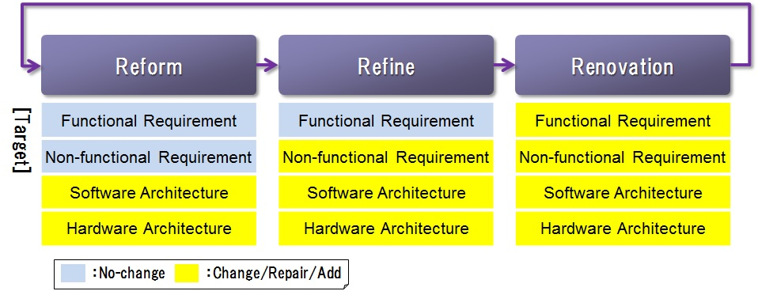
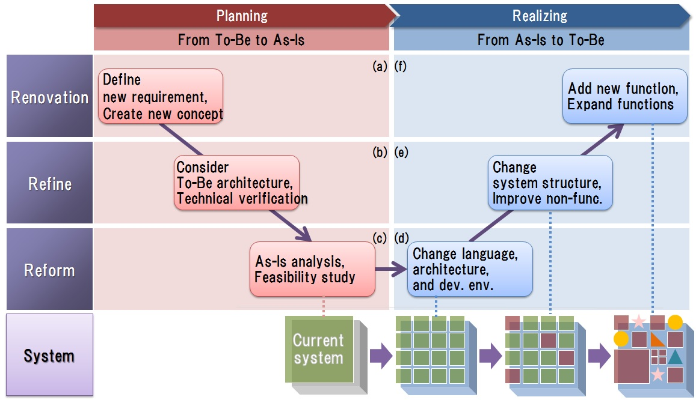
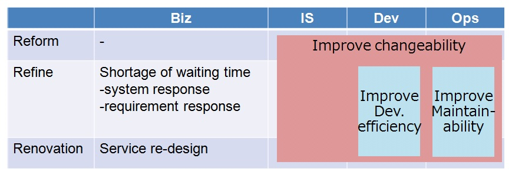

# 1. System Renovation

## <a name="init">1.1. Introduction</a>
### 1.1.1. Main points
　This section explains the following points in detail.
 
* We explain the view of a system renovation for reforming completely continuously.
* We explain the approach for advancing the reform of the system in accordance with three processes (Reform, Refine, Renovation) of constituting a system renovation.

### 1.1.2. Abbreviation
　The abbreviations used in this section are explained in the following table.  
 
| Abbreviation | Explanation |
|---|---|  
|R3|Reform, Refine, Renovation|
|UT|Unit Test|
|CT|Combination Test|
|DB|DataBase|
|PoC|Proof of Concept|
|Biz|Business User|
|IS|Information System Division's User|
|Dev.|Developer|
|Ops.|Operations User| 
 
## <a name="purpose">1.2. Purpose</a>
  The purpose of this section is to propose a view for implementing the global standard systems, for the whole of understanding guidelines.
　The system made applicable to development by this guideline has the following features.

* It is a system employed over the long period of time of tens of years, and a stop and change of a system are an important system which affects many people's business.
* Since maintenance has been developed and performed over tens of years, a scale is large, and it is difficult to grasp the whole system, and there may be shortage of a document and deviation with a source code and a document.
* A system is optimized according to the local business for every site, and even if it is a system which essentially supports the same business, the fine specifications of a system may differ between sites.

 
## <a name="policy">1.3. Policy</a>
　We can consider some approaches in order to develop the global standardization system as described in [Purpose](#purpose), by using the advanced technology.
　However, When a chief aim is put on carrying out a system reform, making full use of the technology of fashion, maintainablity will be low and it not could lead to destroy the measures of risk aversion that has been accumulated over many years. 　
　On the other hand, if it persists in the technology of the present system, it will be difficult to ensure the developer's resources in the global.

　The approach which takes even a generation's system reform into consideration one after another, and minimizes the risk accompanying change of a system taking advantage of predecessors' device and knowledge which have so far been accumulated in the system in order to build the system which develops and is easy to maintain, and it develops gradually and continuously is effective. 　
　So, in this guideline, by applying a system renovation, explains the view for realizing efficient systems development.

## <a name="renovation">1.4. View of system renovation</a>
### 1.4.1. Concept
　In the society where environment, business structure continue changing, in order to correspond to changes flexibly, it is important to renovate a system gradually and continuously.
　　
　System renovation is the view of system development which renovate a system gradually in three processes, Reform, Refine, and Renovation. These three processes are called "R3 process".

|Process|Explanation|
|---|---|
|Reform|To improve easiness of changing of system infrastructure, by not changing services or a structure of a system but changing hardware and software architecture.|
|Refine|To improve non-functional requirements and maintainablitiy of a system, by not changing services but changing a structure of a system, hardware and software architecture.|
|Renovation|To realize a radical renovating of a system and new services with taking advantage of our predecessors' knowledge efficiently.|

　System renovation is realized by applying a suitable process, carrying out each process gradually and continuously, with clarifying improvement effects.

　<a name="fig1">Figure 1：System renovation</a>

### 1.4.2. Application effect

　By applying system renovation, we realize the followings in renovatign a system.

 - To renovate a system efficiently with taking advantage of knowledge about the existing system accumulated for years.
 - To renovate a system with keeping the current functionality, in consideration of influences to business.
 - To build a platform for continueing to renovate a system continuously, not for  large-scale renovating once in several years.

## <a name="r3">1.5. Details of renovation process</a>

　The relationship of R3 process and renovating a system is shown in [Figure 2](#fig2).
 
* An important thing is carrying out gradually rather than carrying out each process at once.
* It does not start from Reform for a start but divide into a planning phase and a realizing phase. In a planning phase, we form a plan of renovating a current system after drawing ideal feature of To-Be system without being caught by current system.

　<a name="fig2">Figure 2：R3 Process</a>

### 1.5.1. Example of each process

　It divides into a planning phase and a realizing phase, shows examples of each process of Reform, Refine, and Renovation which were shown in [Figure 2](#fig2).

**(a) Plan phase： Renovation**   

　In Renovation of a planning phase, we draw ideal feature of To-Be system, and extract To-Be requirements.
　The followings are carried out as an example.

 - To arrange requirements for a To-Be system
 - To derive new concept of a global standardized system

**(b) Planning phase： Refine**     

　In Refine of a planning phase, we exmine the system requirements and architecture, based on the concept and the ideal feature of To-Be system defined by (a)Renovation.
　The followings are carried out as an example.

 - To examine an architecture of a global standardized system (loosely-coupled architecture)
 - To carry out technical verification which led PoC

**(c) Planning phase： Reform**   

　In Reform of a planning phase, we grasp current system, and carry out a feasibility study and planning of renovation towards realizing the system examined by (a)Renovation and (b)Refine.

　The followings are carried out as an example. 
 - To grasp renovation target system;
	 - System whole quantity (the total number of steps, the total number of files, etc.)
     - System structure and syntax
     - Relationship among target systems
 - To examine range of applying new architecture
 - To plan renovation execution

**(d) Realizing phase： Reform**    

　In Reform of a realizing phase, we change the architecture and environment based on the execution plan formulated by the planning phase. In addition, we do not change services (functionality) or system structure.
　The followings are carried out as an example.

 - To convert a programming language (example: cobol to java, VB to JS)
 - To change infrastructure environment
 - To introduce environments for Continuous Integration and Continuous Deploy
 - To change to the new architecture (loosely-coupled architecture)

**(e) Realizing phase： Refine**    

　In Refine of a realizing phase, we improve non-functional requirements with keeping services, that is functionality.
　The followings are carried out as an example.

 - To refactor
 - To realize event-driven architecture by applying a batch framework
 - To improve security by applying security framework
 - To improve processing performance by measures, such as DB standardization
 - To change DB structure within the limits which do not have influence in UT/CT

**(f) Realizing phase： Renovation**    

　In Renovation of a realizing phase, we realize a radical renovating and new services (functionality), with taking advantage of our predecessors' knowledge efficiently.
　The followings are carried out as an example.

 - To add new functions
 - To Redesign a service

### 1.5.2. Effect of each process

 Effects of each process of a renovation process is shown in [Figure 3](#fig3).

* Reform
	* By improving easiness of changing of system infrastructure, it is able to change a system gradualy and continuously. We can reduce workload with various changes work by developers and maintenance persons.

* Refine
	* By improving easiness of changing of system infrastructure, a developer can early meet requirements of shortening processing time and performance improvement, we can improve efficiency of business to which waiting time had generated especially.
	* By improving visibility of a system by arranging implementation of a system, it becomes easy for a developer and a maintenance person to do development and maintenance.

* Renovation
	* Although business changes with environment or situations, by realizing the system which supports following the change continuously and realizing new services, we can renovate user's business.

　<a name="fig3">Figure 3： Effect of R3 process</a>

## <a name="others">1.6. Relation with other sections</a>

　In section 2 or later, we explain in detail technical elements which raised as examples of each process of system renovation.
 - Reform
   - [2. The Loosely-coupled Architecture](guideline_loosely-coupled-architecture-e.md)
   - [3. Using the Standard Interface](guideline_unified-standard-interface-e.md)
   - [5. Continuous Integration](guideline_continuous-integration-e.md)

 - Refine
   - [4. Application Development using a Batch Framework](guideline_batch-framework-e.md)

 - Renovation
   - [6. System Resource Management](guideline_system-resource-mgt-e.md)

* * *
[**Table of contents**](guideline_summery-e.md#guideline-contents)    
[**Glossary**](guideline_glossary-e.md)     
[**Cautions**](guideline_caution-e.md)

