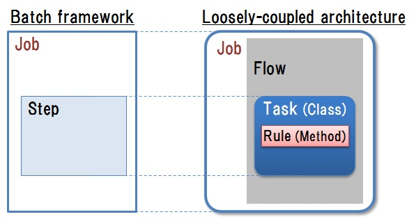
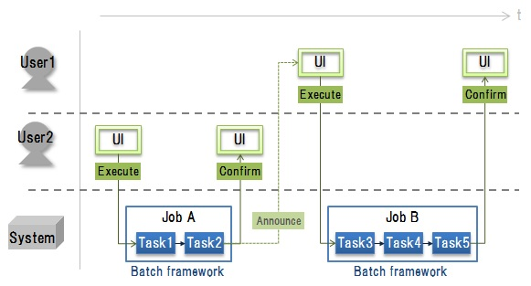

# 4. バッチフレームワークを用いたアプリケーション開発

## <a name="init">4.1. はじめに</a>
### 4.1.1. 本章のポイント
　本章では以下の内容について説明します。詳細は以降にて説明します。
 
* 疎結合化アーキテクチャに基づくシステムを実現するための，バッチ処理を実行，管理するバッチフレームワーク活用の考え方について説明します。
* 疎結合化アーキテクチャにおけるジョブを作成するための，バッチフレームワークを用いたアプリケーション開発の考え方について説明します。

 
### 4.1.2. 略語
　本章にて使用する略語を以下に挙げます。 
 
| 略語 | 説明 |  
|---|---|  
|UI | User Interface | 
|DB | Data Base | 

## <a name="purpose">4.2. 目的</a>
　本章の目的は，以下を実現するためのアプリケーション開発の方法を提案することです。
 
* [疎結合化アーキテクチャ](guideline_loosely-coupled-architecture.md)に基づくシステムの作成を容易にします。
* アプリケーション開発者には，主にドメイン依存の業務の本質的な処理の設計及び実装に集中できるようにします。

## <a name="policy">4.3. 方針</a>
　[目的](#purpose)を達成するために， [疎結合化アーキテクチャ](guideline_loosely-coupled-architecture.md)に基づくシステムのアプリケーション開発において，ソフトウェアのフレームワークを活用します。ソフトウェアのフレームワークは，必要とする汎用的な機能やソフトウェアの主要部分のテンプレート，汎用的で再利用可能なクラス，ライブラリ等を提供するものです。    
　ここで本ガイドラインが対象とするのは，ビジネスのグローバル展開を進める企業の基幹システムです。対象システムでは大量のデータを扱うバッチ処理が多いため，ソフトウェアのフレームワークの中でも，特にバッチフレームワークを活用します。

## <a name="batchFW-concept">4.4. バッチフレームワーク活用の考え方</a>
　[方針](#policy)から，以下のような特徴を備えるバッチフレームワークを活用します。 

* バッチフレームワークとは，バッチ処理を実行，管理するためのフレームワークです。ここでバッチ処理とは，一連の処理を順次に実行することを意味します。
* バッチフレームワークにおけるバッチ処理は，ひとまとまりに実行する単位を設定でき，構成する個々の処理の変更も容易となります。これを用いて [疎結合化アーキテクチャ](guideline_loosely-coupled-architecture.md)における，業務毎に必要なタスクの組合せによるジョブの作成及び実行を容易化します。
* バッチ処理を実現する上で必要となる，以下のような共通的な機能をバッチフレームワークが提供します。
	* ファイル・DBの入出力
	* バッチ処理の実行制御（実行順序，スケジューリング，再実行）
	* バッチ処理のステータス管理
	* ログ出力，他
	
* 上記からバッチフレームワークを用いることで，開発者には非ドメインの共通的なコードの開発は不要とさせます。ゆえにアプリケーション開発者は，ドメインに依存した業務の本質的な処理の開発にのみ集中させます。
* バッチフレームワークを用いるためには，その考え方を理解する必要がありますが，開発のスタイルを規定して，開発の統制を取ることを容易化します。
* バッチフレームワークの詳細は以下の資料，もしくはその他の各種の文献を参照して下さい。    

　　　 [NRI，"Javaによるバッチシステムの開発"，技術創発，2013年2月](https://www.nri.com/jp/opinion/g_souhatsu/pdf/2013/gs201302.pdf)

## <a name="batchFW-ap">4.5. バッチフレームワークを用いたアプリケーション開発の考え方</a>
### 4.5.1. 疎結合化アーキテクチャの実現方針
　バッチフレームワークを用いて以下のようにして，[疎結合化アーキテクチャ](guideline_loosely-coupled-architecture.md)におけるジョブを実現します。

* バッチフレームワークでは，バッチ処理を下表に挙げる要素にて構成します。

| 要素| 説明 |  
|---|---|  
|ジョブ (Job) | 1つのバッチ処理を構成する単位です。 順次実行，並列実行，条件分岐，途中再開の処理パタンがあります。| 
|ステップ (Step) | ジョブを構成する処理プログラムの単位です，ジョブに1つ以上含まれます。 | 

* [疎結合化アーキテクチャ](guideline_loosely-coupled-architecture.md)におけるジョブに対して，上表のバッチフレームワークでの要素を[図1](#fig1)に示すように対応付けて作成します。
	* [疎結合化アーキテクチャ](guideline_loosely-coupled-architecture.md)におけるジョブは，バッチフレームワークにおけるジョブとして扱います。
	* [疎結合化アーキテクチャ](guideline_loosely-coupled-architecture.md)におけるフローは，バッチフレームワークにおけるジョブを構成する処理の実行順序の定義として含めます。
	* [疎結合化アーキテクチャ](guideline_loosely-coupled-architecture.md)におけるタスクは，バッチフレームワークにおけるステップに対応付けます。

    
　<a name="fig1">図1：疎結合化アーキテクチャにおけるジョブの実現方針</a>
 

### 4.5.2. アプリケーションの開発方針
**(1)バッチフレームワークの提供機能の活用方針**    
　バッチフレームワークが提供するバッチ処理の実行制御機能を活用すると，ジョブ実行において下表に挙げた処理パタンが実現できます。これらを用いて，タスクとして作成した業務に必要な処理をジョブとして組み合わせることで，業務処理フローを実現します。   
 
| 実行制御機能| ジョブの処理パタン | 業務処理フローの実現例 |   
|---|---|---|  
| 条件分岐 | 条件判定に基づく処理フローの分岐 | 業務処理フローを実行している地域を判定し，地域毎の個別の業務処理を実行します。|    
| 並列実行 | 複数処理の並列実行 | 計画作成後，整合性チェック処理及び画面出力用データ作成処理を並列して実行します。|    
| ステータス管理，途中再開 | 異常終了後のリラン時は，失敗箇所から再開，未完処理のみ実施 | ①計画作成，②整合性チェック，③計画伝達，という一連の処理を行う業務処理フローがあるとして，処理②を実行中に異常終了した後に，問題解決して再度実行する場合，前回の処理①の実行結果を用いて処理②の実行開始時点から再開します。|   
| データ排他制御 | 複数ジョブによるデータ同時更新の回避 | あるユーザが計画更新のための業務処理を実行して計画データの更新実施中に，他のユーザが業務処理を実行して同一計画データを同時に更新しようとすることを回避して，計画データの整合性を保ちます。 |    

**(2)ワークフローの開発**    
　バッチフレームワークを活用するだけでは，業務のワークフローまでは作成できません。[図2](#fig2)に示すように，バッチフレームワークを用いて作成できる業務処理フロー(ジョブ)は，システムにおける処理のみです。   
 　業務のワークフローを作成するためには，システムだけでなくUIやユーザも含めた全体のフローを別途，設計する必要があります。

 
    
　<a name="fig2">図2：ワークフローの例</a>
* * *
[**目次**](guideline_summery.md#guideline-contents)    
[**用語集**](guideline_glossary.md)     
[**注意事項**](guideline_caution.md)
