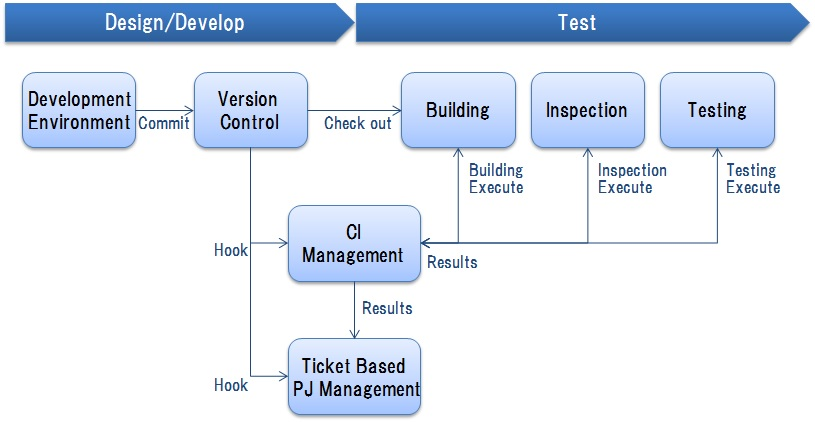
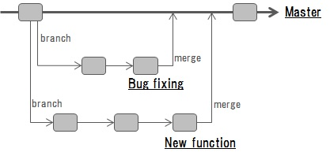

# 5. 継続的インテグレーション

## <a name="init">5.1. はじめに</a>
### 5.1.1. 本章のポイント
　本章では以下の内容について説明します。詳細は以降にて説明します。
 
* ソフトウェア開発における品質改善及び期間短縮のための，ビルドとテストの繰り返しによる継続的インテグレーション（Continuous Integration：CI）実施の考え方について説明します。
* 継続的インテグレーションを効果的に実施するためには，プロジェクト活動の一元管理と見える化，プロジェクト内の効率的なソースコード管理，ビルド及びテストの自動化が重要であり，これらを実現するためのチケット管理システム，バージョン管理システム，ビルドツールとテストツール及びCIツールの組合せや活用の方針について説明します。
* 継続的インテグレーションを効果的に実施するためには継続的にテストを実行していくことが重要であり，テストの方針について説明します。

    
    
### 5.1.2. 略語
　本章にて使用する略語を以下に挙げます。 
 
| 略語 | 説明 |  
|---|---|  
| CI | Continuous Integration |   
| PoC | Proof of Concept |   
| PJ | ProJect |   

## <a name="purpose">5.2. 目的</a>
　本章の目的は，以下を実現するための継続的インテグレーションの考え方，実施方針を提案することです。

*  [疎結合化アーキテクチャ](guideline_loosely-coupled-architecture.md)に基づくシステムの開発及び改修の作業の効率化，高速化を図ります。
* 開発するプログラムについて，要件からの乖離をより小さくして，品質を高く保つようにします。
* 継続的インテグレーションを実施することで，[疎結合化アーキテクチャ](guideline_loosely-coupled-architecture.md)の導入により疎結合化，部品化するソフトウェアプログラムのポータビリティ(異なる環境への移植の容易さ)の向上に寄与させます。

## <a name="policy">5.3. 方針</a>
　[目的](#purpose)を達成する上で，[疎結合化アーキテクチャ](guideline_loosely-coupled-architecture.md)の導入により疎結合化，部品化するソフトウェアプログラムの単位での開発を前提として，開発及び改修の効率化，高速化を実現させます。   
　インテグレーションだけでなく，さらに高速かつ継続的に開発プログラムを本番システムへとデプロイしていく，継続的デリバリーへとつながるようにします。
 
 
## <a name="ci-archi">5.4. 継続的インテグレーションの考え方</a>
　[方針](#policy)から，以下のような特徴を備える継続的インテグレーションを実施します。 
 
* [図1](#fig)に示すように，プログラムのビルドとテストを何度も高速に繰り返すのが，継続的インテグレーションです。ビルドとテストにかかる作業を省力化して，高品質かつ高速に実施するためには自動化，等のアプローチが必要となります。
* 継続的インテグレーションを実施することで，バグ発生時の早期発見と修正コストの低減を容易化させます。また開発着手後の要件の変更や新規追加に対して，柔軟に対応させます。
* 継続的インテグレーション実施がとても効果的となる開発手法の1つがアジャイル開発です。アジャイル開発では短いサイクルで設計，開発，テストを複数回(Iteration)実施します。各サイクル(Iteration)において，継続的インテグレーションを実施します。アジャイル開発は開発期間が短い場合，開始時点で要件がまだ確定していない場合，検証が主な目的となるPoCのための開発を実施する場合，等に有用です。
* 継続的インテグレーションの詳細は以下の資料，もしくはその他の各種の文献を参照して下さい。    
	* 池田尚史，他，"チーム開発実践入門　共同作業を円滑に行うツール・メソッド"，技術評論社    
	* [Martin Fowler, "Continuous Integration"](http://www.martinfowler.com/articles/continuousIntegration.html)
  
 
 
     
 　<a name="fig1">図1：継続的インテグレーション</a>
  

## <a name="ci-impli">5.5. 継続的インテグレーションの実施方針</a>
### 5.5.1. CI環境の構築と運用
　継続的インテグレーションは以下のようにして実施します。
 
* [図2](#fig2)に示すように，設計・開発及びテストのフェーズにて活用する各種のツール(バージョン管理システム，チケット管理システム，CIツール，ビルドツール，インスペクションツール，テストツール)を組合せて，継続的インテグレーションのための環境を構築します。
* バージョン管理システムにてコミット(作業したファイルの更新をリポジトリに反映すること)が発生すると，チケット管理システムにおける関連するチケット，CIツールにおける関連するジョブへの反映を行います。
* バージョン管理システムでのコミットに対して，CIツールは設定に従って各ツールを実行して，ビルド，インスペクション，テストの自動実行を行います。
* 自動実行の結果を，CIツールが集計，レポート作成を行い，チケット管理システムにおける関連するチケットへの反映も行います。
* 上記により，コミット，チケットからビルド・インスペクション・テストの実行結果までのトレーサビリティを担保し，プロジェクトの見える化を実現します。
* ビルド，インスペクション，テストの自動実行のタイミング，実行結果のコミット，チケットへの反映の仕方，不具合ある場合の手順，等の運用ルールを，プロジェクト毎の要件に基づいて規定する必要があります。

 
     
　<a name="fig2">図2：CI環境</a>
 
 

### 5.5.2. チケット管理システムの活用
　以下のようなチケット管理システムを活用します。
 
* プロジェクトにおけるタスク，進捗，懸案事項の管理や情報の共有を行います。
* チケット管理システムを活用することで以下のようなメリットを得られます。
	* プロジェクトにおけるタスクについて，何を・誰が・いつまでにするかと現在の進捗状況を管理できます。
	* タスク，懸案の一覧性，検索性が高くなります。
	* 情報の一元管理とプロジェクト内の共有が容易となります。
	* レポートに利用できます。
* プロジェクト管理をスムーズに行うために，以下のようにしてチケット管理システムとバージョン管理システムを連携して，懸案やバグの追跡を容易化します。
	* 新機能の開発やバグ修正を行う際に，その都度，チケット管理システムにて内容や目的を記述したチケットを作成します。
	* チケットの内容に応じて，コードの作成や修正を行い，バージョン管理システムにコミットします。
	* コミットログには関連するチケットの番号を記入し，チケットにもコミットログの番号を記入します。
	* 上記によりチケットとコードの修正コミットが相互に関連付けます。

### <a name="ver-mgt">5.5.3. バージョン管理システムの活用</a>
　以下のようなバージョン管理システムを活用します。
 
* システム及びアプリケーションの開発に必要なリソースをできる限り全てバージョン管理システムにて一括管理します。例えば，ソースコード，データスキーマ，設定ファイル，設計ドキュメント，等を管理します。
* バージョン管理システムを活用することで以下のようなメリットを得られます。
	* いつ・誰が・何を・どのように変更したかの記録が残ります。
	* バージョン間の差分を簡単に確認できます。
	* 誤って他人の変更を上書きしてしまうことを回避できます。
	* 任意の時点(リビジョン)まで巻き戻すことができます。
	* 複数の派生(ブランチ)を作成することができます。
* 複数人による並行開発を効率的に進めるためにブランチを活用します。
	* [図3](#fig3)に例を示します。例えば，マスタ(リリース可能)から新機能開発のためのブランチ，障害対応のためのブランチをそれぞれ作成します。各ブランチにて独立して作業を行い，各々完了した時点でマスタにマージします。
	
    

     
　<a name="fig3">図3：ブランチの例</a>

### 5.5.4. CIツール・ビルドツール・インスペクションツール・テストツールの活用
　以下のようなツールを活用します。
 
* CIツールは，バージョ管理システム，ビルドツール，テストツール等を組み合わせて継続的インテグレーションを実施します。CIツールを用いることでビルドやテストの自動実行のタイミング設定，実行結果のレポート作成及び通知，実行結果に対するソースコードやチケットまでのトレーサビリティ担保，等を可能とします。
* ビルドツール，インスペクションツール，テストツールは，プロジェクトの要件に合ったものを選択します。ただCIツールと連携して効率的に活用するためには，自動実行の仕組みを持つものが望ましいです。

## <a name="test">5.6. テストの方針</a>
　継続的インテグレーションを実施し開発するプログラムの品質を高く保つための，テスト実施に関する方針を以下に挙げます。
 
* テストの目的は開発したプログラムに潜む不具合を発見することです。不具合を出来るだけ早期に見つけることが修正コストの低減と，より少ないコストでのプログラム品質向上につながります。
	* テストは頻繁かつ継続的に実施します。主に下表に挙げるような種別のテストを実施します。
	* ソフトウェアプログラムを部品化して個々に実装，テスト実施し，実装箇所に適宜修正を加えていく場合，デグレードを回避するためには，それまでに実施されたテストケースを全て実施し直します。   

| テスト種別 | 説明 |    
|---|---|   
| 単体テスト | ソフトウェアを構成する最小単位の部品に対して実施，仕様通りに動作するかを検査します。 |   
| 結合テスト | ソフトウェアの各部品を結合したものが，仕様通りに動作するか(部品間で仕様通りの入出力となるか)を検査します。 |   
| 機能テスト | ソフトウェアの部品を組合せて実現したシステムの機能が，要求通りに動作するか(外部からの入力に対して意図された出力となるか)を検査します。 |  

	
* テスト実施による効果を高めるためには，有用なテストデータを準備することが重要です。
	* テストデータとテストコードの組合せで管理します。テストコードは変えなくとも，テストデータを変更，増やすことでテストケースを増やすことができます。
	* 不具合箇所を早期発見するために，単体テストのテストデータ及びテストコード(ロジックの正しさ検証の観点で作成)を全て用意しておくことが望ましいです。
	* 特に機能テストにて外部システムとの連携を検査する場合は，本番データを用いて本番と同様の条件でテスト実施することが望ましいです。
* 仕様を定義した者が仕様に基づくテストデータとテストコードを準備することが望ましいです。これにより開発者には作成できない本番を想定したデータケースを実施することができます。
* テストを実行する度に，テスト用環境として仮想環境を新しく立ち上げることで，テスト実行の品質を保つことができます。
* バージョン管理システムを用いてブランチを作成して並行開発を実施している場合([「5.5.3.バージョン管理システムの活用」](#ver-mgt)参照)，各ブランチにて個別にテストを実施しながら，マスタにて管理するプログラムの品質を高く維持するためには，各ブランチからマスタブランチへのマージ実施に関して，以下のような許可条件を設けることが望ましいです。
	* ソースコードだけでなくテストデータ，テストコードも登録すること。
	* ビルドが成功し，テスト実行が完了していること。
	* インスペクション実行結果として，重要な問題が検出されていないこと。
	* テスト結果に基づきソースコードを修正する場合，修正内容とドキュメントの内容との整合性が取れていること。
	

* * *
[**目次**](guideline_summery.md#guideline-contents)    
[**用語集**](guideline_glossary.md)     
[**注意事項**](guideline_caution.md)