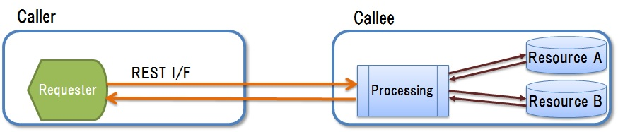

# 3. 標準インタフェース活用

## <a name="init">3.1. はじめに</a>
### 3.1.1. 本章のポイント
　本章では以下の内容について説明します。詳細は以降にて説明します。
 
* システムを構成する要素間の相互接続，もしくは他システムとの連携において，統一して用いるべき標準インタフェースの考え方について説明します。
* 標準インタフェースとして，RESTに基づくインタフェースを用います。RESTに基づくインタフェース活用の方針について説明します。

 
### 3.1.2. 略語
　本章にて使用する略語を以下に挙げます。 
 
| 略語 | 説明 |  
|---|---|  
| I/F | InterFace |
| REST | REpresentational State Transfer |
| HTTP | HyperText Transfer Protocol |
| URI | Universal Resource Identifier |
| CRUD | Create/Read/Update/Delete |

## <a name="purpose">3.2. 目的</a>
　本章の目的は，以下を実現するためのインタフェース活用を提案することです。
 
* [疎結合化アーキテクチャ](guideline_loosely-coupled-architecture.md)に基づくシステムを実現します。
* 実装方式の異なる要素を組み合わせてシステムを構築する場合に，個々の要素の実装の違いを意識しなくとも容易に要素の組合せを可能とします。
* 他システムとの連携を実施する場合に，他システムに対して，システムの内部構成や変更を意識させない，統一の手順でのアクセスを提供します。

## <a name="policy">3.3. 方針</a>
　[目的](#purpose)を達成するために，個々のシステム及びシステムの構成要素に依存せずに共通の考え方や仕様とした，長期間に渡って普遍的なインタフェースを導入します。
 
## <a name="standard-if">3.4. 標準インタフェースの考え方</a>
　[方針](#policy)から，以下のような特徴を備える標準インタフェースを導入します。  

* 本ガイドラインでは，標準インタフェースを，以下の条件を満たすものとして定義します。

	* インタフェースの手順や呼び出し先を指定するための形式は共通にします。
	* 個々のインタフェースを呼び出すことにより実施される操作内容は呼び出し先に関わらず統一の内容とします。
	* 長期間に渡り利用可能なものとします。
	
* 標準インタフェースの呼び出し元には，呼び出し先の実装方式や詳細仕様を意識させずに，インタフェースに対する操作内容を理解させます。
* システムの構成要素を疎結合化した上で（ [「2. 疎結合化アーキテクチャ導入」](guideline_loosely-coupled-archit３ecture.md)参照），要素間を標準インタフェースを用いて相互接続することで，同一システム内でも実装形式の異なる要素を組合せて使用することを可能とします。

 
## <a name="if-impli">3.5. 標準インタフェースの実現方針</a>
### 3.5.1. RESTの活用
　RESTは，ネットワーク分散型システムのアーキテクチャスタイル（考え方）です。RESTの詳細は以下の資料，もしくはその他の各種の文献を参照して下さい。    
　 [Roy Fielding, "Architectural Styles and the Design of Network-based Software Architectures, Chapter 5"](http://www.ics.uci.edu/~fielding/pubs/dissertation/rest_arch_style.htm)   
 
　以下の理由からRESTに基づくインタフェースを，[「3.4. 標準インタフェースの考え方」](#standard-if)に従う標準インタフェースとして活用します。
 
* 以下により，インタフェースによる呼び出し先の指定形式が共通で，操作が統一されています。
  * システム内の利用可能な情報を呼び出し先（リソース）として扱います。
  * 各リソース(URI)に対して特定の操作(GET, POST，PUT，DELETE：リクエストを送りレスポンスを受ける)を行います。

* 汎用的に使用されているHTTPプロトコルをベースとしていますので，比較的単純であるとともに，要素の実装に特定の方式を選択する必要はなく，長期間に渡り使用できます。

### 3.5.2. インタフェースによる操作
　RESTに基づくインタフェースによる操作は以下のようにします。   
 
**(1)操作の分類**    
　RESTに基づくインタフェースによる操作(GET，POST，PUT，DELETE)と，各操作に該当する[疎結合化アーキテクチャ](guideline_loosely-coupled-architecture.md)における処理内容を下表にまとめます。     
 
| 操作 | アクセス先（リソース）への操作内容 | 疎結合化アーキテクチャにおける処理内容 |    
|---|---|---|   
| GET | リソースの取得 | ・UIまたは他システムが，データリポジトリからデータを取得します。|   
| POST | リソースの新規作成 | ・UIまたは他システムが，データリポジトリのデータを新規作成します。 ・UIまたは他システムが，ジョブに対して処理実行を要求します。 |   
| PUT | リソースの更新 | ・UIまたは他システムが，データリポジトリのデータを更新します。 |   
| DELETE | リソースの削除 | ・UIまたは他システムが，データリポジトリのデータを削除します。 |   

*【例：UIもしくは他システムから処理実行を要求して処理結果を取得】*  
　従来は，1回の処理実行要求のリクエストに対するレスポンスとして処理結果を取得していました。     
 　しかし上表からRESTに基づくインタフェースを使用する場合は，以下の2ステップの手順を順に実施するものとし，処理実行要求と処理結果データ取得は別の操作となります。     

1. UIもしくは他システムが，ジョブに対して処理実行を要求する。(POST)
2. UIもしくは他システムが，データリポジトリから処理結果データを取得する。(GET)

**(2)インタフェースによる操作を実施する処理の考え方**    
 　RESTに基づくインタフェースによる操作を実施する場合の処理実装パタンは，下表に挙げる2つに大別されます。  
  

|#| 処理実装パタン | 概要 | 
|---|---|---|
|1| 間接アクセス |・リソースに対する操作は，インタフェースの呼び出し先でリソースに対して実行される処理(CRUD)を介した間接的なアクセス処理とします。 ・[図1](#fig1)に概要を示します。|    
|2| 直接アクセス |・リソースに対する操作は，インタフェースの呼び出し元から呼び出し先のリソースに対する直接的なアクセス処理(CRUD)とします。 ・[図2](#fig2)に示します。|

  　　
 
    
　<a name="fig1">図1：間接アクセス処理実装パターン</a>
 　

    
　<a name="fig2">図2：直接アクセス処理実装パターン</a>
   
   
　操作に対するリソースの整合性を保証する観点から，RESTに基づくインタフェースによる操作は以下の方針にて実装するとします。これによりRESTに基づくインタフェースの操作に対して処理実装パタンは下表のように割り当てます。   
 
* リソースに影響を与える操作(POST，PUT，DELETE)は，インタフェースの呼び出し元の内部でのみリソースへのアクセス処理を許容しします。
* リソースに影響を与えない操作(GET)は，インタフェースの呼び出し元の内部だけでなく外部からもリソースへのアクセス処理を許容します。
 
|#| 処理実装パタン | GET | POST | PUT | DELETE |
|---|---|---|---|---|---|
|1| 間接アクセス |✔|✔|✔|✔|    
|2| 直接アクセス |✔|　|　|　|    
  
* GETの操作に対して2つの処理実装パタンのいずれを採用するかは適用先での要件に基づいて決めます。以下に対応する要件を挙げます。
 
 
|#| 処理実装パターン | 対応する要件 |   
|---|---|---|   
|1| 間接アクセス | ・グローバルに共通の加工方式によるデータを活用します。 ・グローバルに開発の統制を実施します。|  
|2| 直接アクセス | ・拠点毎の個別の加工方式によるデータを活用します。 ・拠点毎にプログラムの開発，保守を実施します。 |   
 
 

 

 

* * *
[**目次**](guideline_summery.md#guideline-contents)    
[**用語集**](guideline_glossary.md)     
[**注意事項**](guideline_caution.md)

