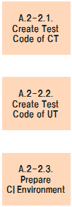

# PCS/CATS Reform Reference - A.2-2. Implement Test Code

## A.2-2. Implement Test Code

## Table of contents

1. [A.2-2.1. Create Test Code of CT](#a2-21-create-test-code-of-ct)
1. [A.2-2.2. Create Test Code of UT](#a2-22-create-test-code-of-ut)
1. [A.2-2.3. Prepare CI Environment](#a2-23-prepare-ci-environment)

## A.2-2.1. Create Test Code of CT

| #  | Element                      | Content |
|----|------------------------------|---|
| 1  | **Summary**                  | CT用のテストコードを作成する。  - サブシェル用のテストコードを作成する際、呼び出し元メインシェル内で設定している環境変数を確認する必要がある。   - まずサブステップ用テストコードを作成し、それらの情報を整理・統合しメインステップ用テストコードを作成する。 |
| 2  | **Objective & Concept**      | テストを可能にするため。 |
| 3  | **Output creation rule**     | - テスト方針 |
| 4  | **Input**                    | - メインシェル・サブシェルのソースコード |
| 5  | **Output**                   | - CT用JAVAテストコード  |
| 6  | **Sample & Template & Tool** | [(sample)Dn6275lmTest.java](reform_sample/Dn6275lmTest.java) |
| 7  | **Basic unit**               | - メインシェル100行あたり8時間   - サブシェル400行あたり24時間 |
| 8  | **Findings & Issues**        | [Findings & Issues List](https://jp.nissan.biz/redmine/projects/coe_guideline/issues?query_id=515) |

## A.2-2.2. Create Test Code of UT

| #  | Element                      | Content |
|----|------------------------------|---|
| 1  | **Summary**                  | UT用のテストコードを作成する。  COBOLのサブプログラムはデータに書き出されていない**状態**を多く持っており、本番データからのテストが困難である。 そのため、メインプログラム（サブシェルから呼ばれているもの）のみテスト対象とする。 |
| 2  | **Objective & Concept**      | テストを可能にするため。 |
| 3  | **Output creation rule**     | - テスト方針 |
| 4  | **Input**                    | - ソートシェル・COBOLのソースコード |
| 5  | **Output**                   | - UT用JAVAテストコード |
| 6  | **Sample & Template & Tool** | [(sample)E62x20Test.java](reform_sample/E62x20Test.java) |
| 7  | **Basic unit**               | - ソートシェル10行あたり0.4時間   - COBOL200行あたり2時間 |
| 8  | **Findings & Issues**        | [Findings & Issues List](https://jp.nissan.biz/redmine/projects/coe_guideline/issues?query_id=516) |

## A.2-2.3. Prepare CI Environment

| #  | Element                      | Content |
|----|------------------------------|---|
| 1  | **Summary**                  | CI環境を構築する。   CI設定がバージョン管理されており、ソースコードのバージョンとの対応がつくこと。 |
| 2  | **Objective & Concept**      | CIを可能にするため。 |
| 3  | **Output creation rule**     | N/A |
| 4  | **Input**                    | N/A |
| 5  | **Output**                   | PCS Reform Trialでは以下のツールを含むCI環境を作成した。   - リポジトリ：GitLab   - CIツール：GitLabCI   - 静的解析ツール：SonarQube  |
| 6  | **Sample & Template & Tool** | N/A |
| 7  | **Basic unit**               | N/A |
| 8  | **Findings & Issues**        | [Findings & Issues List](https://jp.nissan.biz/redmine/projects/coe_guideline/issues?query_id=517) |