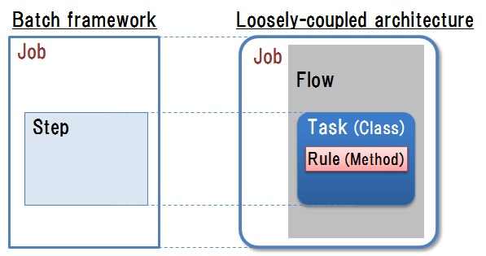
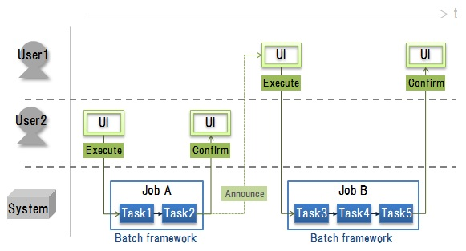

# 4. Application Development using a Batch Framework

## <a name="init">4.1. Introduction</a>
### 4.1.1. Main points
　This section explains the following points in detail.
 
* We explain the view of using the batch framework which performs batch processing for realizing the system based on a loosely-coupled architecture, and it manages.
* We explain the view of the application development using the batch framework for creating the job in a loosely-coupled architecture.

 
### 4.1.2. Abbreviations
　The abbreviations used in this section are explained in the following table. 
 
| Abbreviation | Meaning |  
|---|---|  
|UI | User Interface | 
|DB | Data Base | 

## <a name="purpose">4.2. Purpose</a>
　The purpose of this section is to propose the method of the application development for implementing the items listed below.
 
* The system based on [a loosely-coupled architecture](guideline_loosely-coupled-architecture.md) is created easily.
* An application developer can mainly concentrate on a design and implementing of essential processing of the business of domain dependence.

## <a name="policy">4.3. Policy</a>
　To achieve [the purpose](#purpose), a software framework is utilized in the application development of a system based on [a loosely-coupled architecture](guideline_loosely-coupled-architecture.md). A software framework offers the template of the general-purpose main part of a function or software to need, a general-purpose and recyclable class, a library, etc.    
　The target system of this guideline is a mission critical system of the company which advances global deployment of business. In an target system, since there is much batch processing treating a lot of data, especially we utilize a batch framework also in a software framework.

## <a name="batchFW-concept">4.4. The view of using a batch framework</a>
　According to [the policy](#policy), we introduce a batch framework that has the following features. 

* A batch framework is a framework for performing and managing batch processing.  A batch processing means performing a series of processings one by one here.
* The batch processing in a batch framework can set up the unit performed to a bundle, and becomes easy to change each of processings which constitute the batch processing. It becomes easy to create and execute a job in [a loosely-coupled architecture](guideline_loosely-coupled-architecture.md) by the combination of a required task the whole business.
* A batch framework offers the following common functions which are needed when realizing batch processing.
	* Input and output of a file and DB
	* Execution control of batch processing (execution sequence, scheduling, rerun)
	* Status management of batch processing
	* Logging, others
	
* By using a batch framework from the above, development of a common code of a non-domain is unnecessary to a developer. Therefore, an application developer can be concentrated only on development of essential processing of the business depending on a domain.
* In order to use a batch framework, the view needs to be understood, but it is easy to specify the style of development and to take control of development.
* For more information on a batch framework, refer to the source listed below or various other resources.    

　　　 [NRI，"Development of the batch system by Java"，Gijutsu Souhatsu，2013/2](https://www.nri.com/jp/opinion/g_souhatsu/pdf/2013/gs201302.pdf)

## <a name="batchFW-ap">4.5. The view of the application development using a batch framework</a>
### 4.5.1. The policy of realizing a loosely-coupled architecture
　A job in [a loosely-coupled architecture](guideline_loosely-coupled-architecture.md) is realized using a batch framework as follows.

* In a batch framework, batch processing consists of elements in the following table.

| Element| Description |  
|---|---|  
|Job | A unit which constitutes one batch processing. There are processing patterns like sequential execution, parallel execution, conditional branch and resumption.| 
|Step | A unit of the processing program which constitutes a job. It is contained in one or more jobs. | 

* As shown in [Fig. 1](#fig1), elements in a batch framework of the upper table are matched and created to a job in [a loosely-coupled architecture](guideline_loosely-coupled-architecture.md).
	* The job in [a loosely-coupled architecture](guideline_loosely-coupled-architecture.md) is treated as a job in a batch framework.
	* The flow in [a loosely-coupled architecture](guideline_loosely-coupled-architecture.md) is included as a definition of the execution sequence of the processing which constitutes the job in a batch framework.
	* The task in [a loosely-coupled architecture](guideline_loosely-coupled-architecture.md) is matched with the step in a batch framework.

    
　<a name="fig1">Figure 1: The policy of realizing the job in a loosely-coupled architecture</a>
 

### 4.5.2. The policy of application development
**(1)The policy of using functions provided by a batch framework**    
　If we use execution control functions of batch processing provided by a batch framework, the processing pattern listed at the following table in job execution is realizable. Using these functions, a business processing flow is realized by combining as a job processing required for the business created as a task.   
 
| Execution control function| Processing pattern of a job | Example of realizing business processing flow |   
|---|---|---|  
| Conditional branch | Processing flow branch based on condition determination | The area which is performing the business processing flow is judged and the individual business processing for each area is performed.|    
| Parallel execution | Parallel execution of plural processings | After planning, compatibility check processing and data creation processing for displays are arranged in parallel and performed.|    
| Status management，resumption | At the time of the rerun after an abnormal end, resumption from a failure part and carring out only incomplete processings. | There is a business processing flow which performs a series of processings called (1)plan creation, (2)compatibility check, and (3)plan transfer. When carrying out problem solving and performing again after carrying out the abnormal end of the processing (2) during execution, it resumes from execution of the last processing (1).|   
| Data exclusive control | Evasion of data concurrent updating by plural jobs | The business processing for a certain user's plan updating is performed, and during updating plan data, other users avoid that a business processing tends to be performed and it is going to update the same plan data simultaneously, and maintain the compatibility of plan data. |    

**(2)Development of a workflow**    
　The workflow of business cannot create only by using a batch framework. As shown in [Fig. 2](#fig2), the business processing flow (job) which can be created using a batch framework is only processing in a system.   
 　In order to create the workflow of business, it is necessary to design the flow of the whole not only including a system but UI and a user.

 
    
　<a name="fig2">Figure 2: Example of a workflow</a>
* * *
[**Table of contents**](guideline_summery-e.md#guideline-contents)    
[**Glossary**](guideline_glossary-e.md)     
[**Cautions**](guideline_caution-e.md)