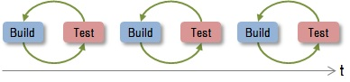
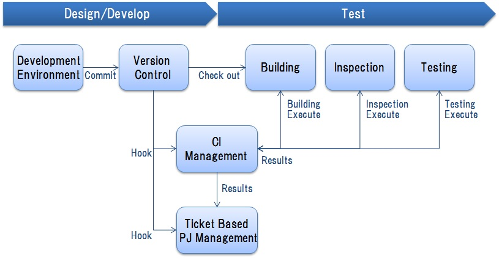
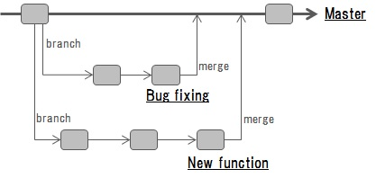

# 5. Continuous Integration

## <a name="init">5.1. Introduction</a>
### 5.1.1. Main points
　This section explains the following points in detail.
 
* We explain the view of the Continuous Integration (CI) by building for shortening, and repetition of a test during the quality improvement in software development, and the period.
* In order to carry out Continuous Integration effectively, unified management and visualization of project activities, efficient source code control, building and test automation are important. For realizing them, we explain the combination of the ticket managerial system, a version control system, a build tool, a test tool and CI tool, and the view of practical use. 
* In order to carry out Continuous Integration effectively, it is important to perform a test continuously. We explain the view of a test.
    
    
### 5.1.2. Abbreviations
　The abbreviations used in this section are explained in the following table. 
 
| Abbreviation | Meaning |  
|---|---|  
| CI | Continuous Integration |   
| PoC | Proof of Concept |   
| PJ | ProJect |   

## <a name="purpose">5.2. Purpose</a>
　The purpose of this section is to propose the view of Continuous Integration for implementing the items listed below, and an enforcement policy.

* Efficiency of the work of development and repairing of systems based on  [loosely-coupled architecture](guideline_loosely-coupled-architecture.md), improvement in the speed.
* About the program developed, deviation from requirements is made smaller and quality is kept high.
* By carrying out Continuous Integration, it contributes to loose-coupling-izing and improvement in the portability (ease of a transplant by different environment) of the parts-ized software program by introducing [a loosely-coupled architecture](guideline_loosely-coupled-architecture.md). 

## <a name="policy">5.3. Policy</a>
　To achieve [the purpose](#purpose), by introducing [a loosely-coupled architecture](guideline_loosely-coupled-architecture.md), we realize efficiency of development and repairing, improvement in the speed on the assumption that development in the loose-coupling-ized unit of a software program.   
　It is made to be connected not only to integration but to the Continuous Delivery which carries out deploy of the development program to the on-line system at high speed and continuously.
 
 
## <a name="ci-archi">5.4. View of Continuous Integration</a>
　According to [the policy](#policy), we carry out Continuous Integration that has the following features. 
 
* As shown in [Fig. 1](#fig1), Continuous Integration repeats building and the test of a program at high speed repeatedly. In order to economize the work concerning building and test and in order to carry out with high quality and at high speed, an approach of automation is needed. 
* By carrying out Continuous Integration, we do facilitating of the early detection of a bug, and the reduction of correction cost. Moreover, we make it correspond flexibly to changes and new addition of requirements after development start. 
* One of the development techniques which become very effective by Continuous Integration is agile development. In agile development, multiple-times (iteration) enforcement of a design, development, and the test is carried out in a short cycle. Continuous Integration is carried out in each cycle (iteration). Agile development is useful when a development cycle is short, when requirements have not been decided yet at the start time and when carrying out development for PoC used as the purposes with a main verification. 
* For more information on Continuous Integration, refer to the source listed below or various other resources.    
	* Ikeda, etc., "A guide to team development practice"，Gijutsu-Hyohron    
	* [Martin Fowler, "Continuous Integration"](http://www.martinfowler.com/articles/continuousIntegration.html)
  
 
 
     
 　<a name="fig1">Figure 1: Continuous Integration</a>
  

## <a name="ci-impli">5.5. Enforcement policy of Continuous Integration</a>
### 5.5.1. Construction and employment of the CI environment
　Continuous Integration carries out as follows. 
 
* As shown in [Fig. 2](#fig2), the environment for Continuous Integration is built combining various kinds of tools (a version control system, a ticket based project management system, CI tool, a build tool, an inspection tool, a test tool) utilized in the phase of a design, development, and a test. 
* If a commitment (reflect renewal of a file in a repository) occurs with a version control system, reflection to the related ticket in a ticket based project management system and the related job in CI tool will be performed. 
* In response to a commitment with a version control system, CI tool performs each tool according to a setup, and performs automatic execution of building, inspection and test. 
* CI tool totals the result of automatic execution, creates reports, and also performs reflection to the related ticket in a ticket based project management system. 
* By the above, the traceability from a commitment to a ticket, build, inspection and test is collateralized and visualization of a project is realized. 
* It is necessary to specify operation rules, such as a timing of automatic execution of building, inspection and test, a method of the reflection of execution results to a commitment and a ticket, a procedure when a fault is occured, based on requirements for every project. 

 
     
　<a name="fig2">Figure 2: CI environment</a>
 
 

### 5.5.2. Use of a ticket based project management system
　A ticket based project management system is utilized as follows.
 
* Tasks, progress and pending issues in a project are managed, and information are shared. 
* We obtain following merits by utilizing a ticket based project management system. 
	* Enable to manage what, by whom, by when a task is carried out in a project and to manage current status. 
	* Easy to search tasks and pending issues. 
	* Easy to do unified management of information and sharing in a project . 
	* Enable to use for reporting. 
* In order to perform project management smoothly, it cooperates a ticket based project management system and a version control system and pursues easily pending issues and bugs as follows. 
	* When developing a new function and correcting a bug, create each time the ticket which described the contents and the purpose by the ticket based project management system. 
	* According to the contents of the ticket, create and correct codes and commit a version control system. 
	* Enter the number of a related ticket in a commitment log, and enter the number of a commitment log also in a ticket. 
	* By the above, associate the ticket and the commitment of correcting codes mutually. 

### <a name="ver-mgt">5.5.3. Use of a version control system</a>
　A version control system is utilized as follows.
 
* Resources required for development of system and application are altogether managed as much as possible collectively with a version control system. For example, source code, data schema, configuration file, design document, etc. are managed. 
* We obtain following merits by utilizing a version control system. 
	* Remain records about when/by whom/what/how it is changed. 
	* Easy to check differences between versions. 
	* Avoid to overwrite others' change accidentally. 
	* Enable to rewind till arbitrary points in time (revision). 
	* Enable to create plural derivations (brunchs). 
* A brunch is utilized in order to further efficiently parallel development by plural persons. 
	* An example is shown in [Fig. 3](#fig3). For example, the brunch for developing a new function and the brunch for bug fixing are created from the master (a release is possible) respectively. It works independently in each brunch, and when it completes respectively, it merges into the master. 
  
     
　<a name="fig3">Figure 3: Example of brunch</a>

### 5.5.4. Use of CI tool, build tool, inspection tool and test tool
　The following tools are utilized.
 
* CI tool carries out Continuous Integration combining a version control system, a build tool, a test tool, etc. By using CI tool, timing setting of automatic execution of building and test, Report creation of the execution results and notice, traceability from an execution result to a source code and a ticket, etc. are enabled.  
* Choose a build tool, an inspection tool and a test tool suitable for requirements for a project. In order to cooperate with CI tool and to utilize efficiently, a tool with structure of automatic execution is desirable. 

## <a name="test">5.6. Test policy</a>
　Test policy for keeping high quality of programs developed with Continuous Integration is listed to below. 
 
* The purpose of a test is to discover bugs lurking in the developed program. Finding bugs at an early stage as much as possible leads to reduction of correction cost, and quality improvement of the program in less cost. 
	* A test is carried out frequently and continuously. Mainly tests listed at the following table are carried out. 
	* If a software program is parts-ized, implemented and tested separately, in order to avoid degrade, all the test cases carried out by then are recarried out. 

| Type of test | Explanation |    
|---|---|   
| Unit test | It carries out to the parts of the minimum unit which constitutes software, and it is inspected whether it operates as specification. |   
| Combination test | It is inspected whehter what combined each part article of software operates as specification. |   
| Function test | It is inspected whether the function of the system realized combining parts of software operates as a demand. |  
	
* In order to heighten the effect by test, it is important to prepare useful test data.  
	* It manages in the combination of test data and a test code. Even if a test code does not change, test data can be changed and it can increase a test case by increasing. 
	* In order to carry out early detection of bugs, it is desirable to prepare all of the test data and the test code (it creates in the viewpoint of rightness verification of logic) of a unit test.
	* When inspecting cooperation with an external system especially in a function test, it is desirable to carry out test on the same conditions as on-line system using on-line data. 
* It is desirable for those who defined specification to prepare the test data based on specification and test code. Thereby, a developer can carry out the test case supposing on-line system which cannot be created.  
* The quality of test execution can be maintained by starting virtual environment newly as environment for a test, whenever it performs a test. 
* When brunches are created using a version control system and parallel development is being carried out (refer to ["5.5.3. practical use of a version control system"](#ver-mgt)), testing individually at each brunch, in order to maintain high quality of programs managed in the master, it is desirable to establish the following conditions about merging to the master brunch from each brunch. 
	* Register not only a source code but test data and a test code.
	* Building should be successful and test execution should be completed.
	* Important problems should not be detected as an inspection execution result. 
	*  When correcting a source code based on a test result, take the compatibility of change contents and the contents of the document. 
	

* * *
[**Table of contents**](guideline_summery-e.md#guideline-contents)    
[**Glossary**](guideline_glossary-e.md)     
[**Cautions**](guideline_caution-e.md)