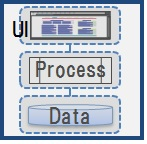
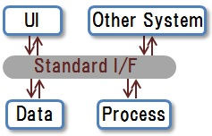
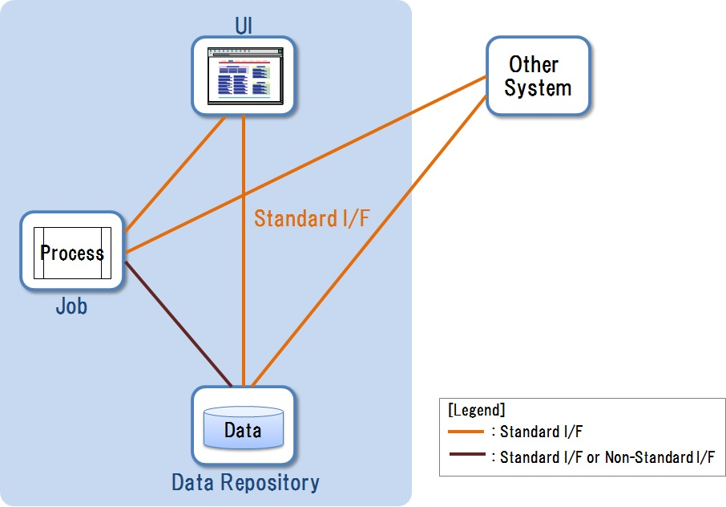
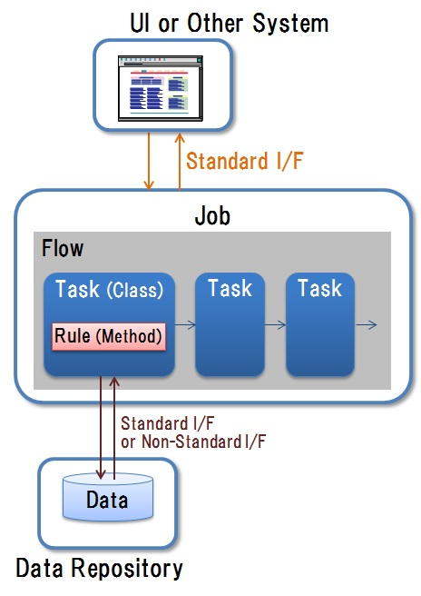

# 2. The Loosely-coupled Architecture

## <a name="init">2.1. Introduction</a>
### 2.1.1. Main points
　This section explains the following points in detail.
 
* The system comprises elements that implement the UI for business logic, elements that implement specific processing logic, and elements that store data on the basis of a data model. We explain the loosely-coupled architecture, in which those three types of elements are combined to construct systems and business logic.
* Loosely-coupled elements are suited to microservices. We explain here the concept of loosely-coupled elements based on the concept of microservices.
 
### 2.1.2. Abbreviations
　The abbreviations used in this section are explained in the following table. 
 
| Abbreviation | Meaning |  
|---|---|  
| UI | User Interface | 
| I/F | Interface |
| DB | Data Base |
| PCS | Production Control System |

## <a name="purpose">2.2. Purpose</a>
　The purpose of this section is to propose an architecture for implementing the items listed below.

* Targeting systems that develop globally, systems are easily constructed by using globally-shared functions and combining business logic processes that have different content and processing orders at each site.
* It is also easy to minimize the scope of effects from system changes and failures and to identify the scope of effects.     

## <a name="policy">2.3. Policy</a>  
　As summarized in the following table, the As-Is system has a monolithic architecture in which processing and data are tightly coupled, making it difficult to identify the scope of effects from modifications or failures. The To-Be system, on the other hand, has a loosely-coupled architecture that separates the constituent elements of the system and connects them via a unified standard interface. 

 

| Object | Architecture | Outline |
|---|---|---|
| As-Is System (Monolith) | ・Processing and data are tightly coupled. ・Each system uses its own interface.  | |
| **To-Be System** | **・System elements (processes, data, and UI) are separate and loosely-coupled. ・Elements are connected via a unified standard interface.** | |
    
 
## <a name="archi">2.4. Basic principles of the architecture</a>
　In line with [the policy](#policy), we propose an architecture in which system components are loosely-coupled ([Fig. 1](#fig1)) and has the features described below.  
 
* A system is divided into the types of elements listed in the following table. Each element executes a specific function or series of functions and is implemented as a software program.

    | Type | Description | Comments |  
    |---|---|---|  
    | Job | Elements that implement an individual processing logic. | This corresponds to the main shell in the current PCS. For more information, refer to section ['2.5.2. Defining loosely-coupled elements'](#module-def).|    
    | UI | Elements that implement a UI for business logic. | |
    | Data repository | Elements for storing data on the basis of a data model. | |

* Individual elements are created as units that are easy to develop and manage. For more information, see section ['2.5. Loosely-coupled elements'](#module-design).   
* Basically, all elements are interconnected by a unified standard interface. The standard interface is described in detail in section ['3. Using the Standard Interface'](guideline_unified-standard-interface.md).
* However, a non-standard interface can be used within a system when giving consideration to performance or the size of data transferred. 
* Calls to jobs and data repositories from other systems can also use the standard interface.
* It is not necessary for all of the system constituent elements to be written in the same programming language or use the same technology. Even within a system, elements can be implemented with different languages and technology. 
* Systems and business logics are constructed as combinations of one or more of the elements described above. 
* Implementation, testing, and deployment can all be done in units of loosely-coupled elements. 
* The element serves as the unit for modifications and replacements, so the scope of effects for modifications or failures is easily minimized or identified.   

    
　<a name="fig1">Figure 1: Loosely-coupled architecture</a>

## <a name="module-design">2.5. Loosely-coupled elements</a>
　The loosely-coupled elements in a [loosely-coupled architecture](#archi) are created according to the concept of microservices and the definition and implementation policy for a loosely-coupled element described below. 
 
### <a name="microservice">2.5.1. Microservices</a>
　The concept of microservices serves as a reference for loosely-coupled elements in a [loosely-coupled architecture](#archi).

 
* For the definition of a microservice, refer to　　    
 　[James Lewis, Martin Fowler, "Microservices"](http://martinfowler.com/articles/microservices.html)    
* In a [loosely-coupled architecture](#archi), loosely-coupled elements are units that correspond to microservices. That is to say, they are units of development and deployment that are called via a standard interface. 
* The granularity of loosely-coupled elements requires attention. If the granularity of elements is too fine, management becomes difficult with respect to maintenance and operations. The cost of access via the standard interface also increases.

### <a name="module-def">2.5.2. Defining loosely-coupled elements</a>
　The three types of elements that are introduced in a [loosely-coupled architecture](#archi) are defined below on the basis of the [microservice concept](#microservice).

**(1) Job**    
　A job ([Fig. 2](#fig2)) is defined as follows.　　　

* A job is a unit of completed function in implementing business logic in a system.   
* A job is a unit that is called from another system or other element via the standard interface.     
* A job is a collection of one or more flows.   
  
　A flow for constructing jobs is as follows.   
 
* A flow is a collection of one or more tasks.   
* Job execution is achieved by sequentially executing the tasks that constitute flows. A flow defines the order and conditions for the execution of the tasks that constitute a job. Tasks are executed according to a flow.   
  
　The tasks that constitute a flow are listed below.   
 
* A task is a single transaction unit that is a sub-function of a system function for implementing business logic. It is a minimal reusable unit. That is to say, reuse as a program can be at any level of unit, including job (which includes tasks and flows), flow (which includes tasks), and tasks alone.     
* A task includes the rules that become the processing logic of the sub-functions mentioned above. Because the rules in a task are highly dependent, there is no reuse at the level of rules.    
* Data repositories are accessed in units of tasks.　　　　
  
　Examples of a job and a task are given below for the case of a production control system.
 
* Job: Create a production plan. 
* Task: Receive and process monthly orders and create monthly plans. Create daily schedules. 

　The correspondence between the job, flow, and task elements and the constituent elements of the current PCS is shown in the following table. 
 
| Element | Element of current PCS |   
|---|---|   
| job | Main shell |  
| flow | Subshell |  
| task | Program, command |  

 
    
　<a name="fig2">Figure 2: Job definition</a>
 
**(2) UI**    
　A user interface (UI) is defined as follows.    
 
* The UI presents the operations and information used by business logic by means such as an operation window or an information window, etc. 
* Jobs or data repositories are called by UI only via the standard interface. 

**(3) Data repository**    
　A data repository is defined as follows.    
 
* Stores the data used by a system.
* The stored data conforms to a common data model that is specified by the system.
* Data that is stored in a data repository is accessed by another element (job or UI) or another system via the standard interface.
* From a job, data can be accessed via an interface other than the standard interface as well as via the standard interface.

### <a name="module-impli">2.5.3. Implementation policy for loosely-coupled elements</a>

　Loosely-coupled elements are implemented according to the policy outlined below. For more information on the job implementation method, see section ['4. Application Development with the Batch Framework'](guideline_batch-framework.md). 

**(1) Job**    
* A job is implemented as a collection of one or more processes. A job includes a flow, which defines the order and conditions for process execution.
* The tasks that constitute jobs, and flows are implemented as *classes*
* The rules in a task are implemented as class *methods*.
* The input data and output data of task (class) processes, and the parameter data referenced by processes are all stored in a data repository.
 
**(2) UI**    
* The UI is implemented with technology determined by the system or business logic.
* Calls to job processes, access to data repositories, and retrieval of results are executed only via the standard interface. Processing of the execution results is performed and displayed on the screen.

**(3) Data repository**    
* Store data in DBs and files, etc.
* Implement processing for access to stored data by the standard interface. 
* For jobs running on the same computer, access processing is implemented by an individual interface.

* * *
[**Table of contents**](guideline_summery-e.md#guideline-contents)    
[**Glossary**](guideline_glossary-e.md)     
[**Cautions**](guideline_caution-e.md)
