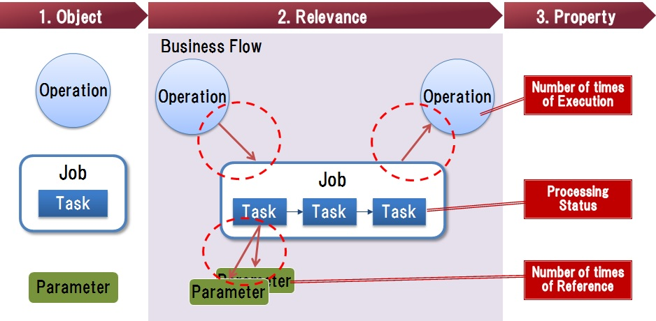
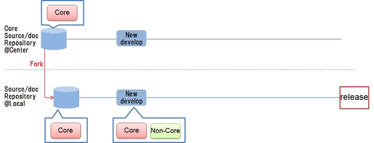
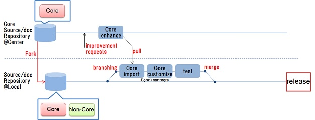
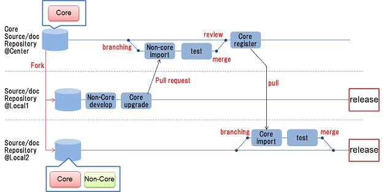

# 6.  System Resource Management

## <a name="init">6.1. Introduction</a>
### 6.1.1. Main points
　This section explains the following points in detail.
 
* We explain the view of system resource management for developing, maintaining and operating the system also corresponding to local requirements, following the standard specified globally.
* We explain the view of resource visualization for grasping clearly the object which should be managed which is needed when carrying out system resource management.
* We explain the view of control for maintaining system structure which is needed when carrying out system resource management.
 
### 6.1.2. Abbreviation
　The abbreviations used in this section are explained in the following table. 
 
| Abbreviation  | Explanation  |  
|---|---|  
| UI | User Interface | 

## <a name="purpose">6.2. Purpose</a>
　The purpose of this section is to propose the view of the system resource management for realizing the following.
 
* In case that we develop the systems based on [The loosely coupled architecture](guideline_loosely-coupled-architecture.md) globally, following the standard specified globally, local requirements are also made to agree and make it easy to develop and apply on each local.
* In development and repair of a system, the reusability of a component is made high and improve productivity of systems development and repair.

## <a name="policy">6.3. Policy</a>
　This guideline's target is the mission critical systems of company, these systems are usually large scale and continued extension development over a long period of time at each site. For this reason, it was difficult to grasp whole figure of system, and the reusability of the source code was also low.
　In order to achieve [the purpose](#purpose), we proposed the view for clarifying and maintaining the common portion and relationship of a component between global systems. Moreover, we proposed the view for taking development control in order to maintain the structure of the system which is the target of the above-mentioned management.

## <a name="system-resource">6.4. View of System resource management</a>
　Based on [the policy](#policy), We propose the system resource management with the following features.
 
* "The resource" is what needs a system in each phase designed, implemented, tested and released. Give the example of a resource at the following table.
* "System resource management" is managing the resource globally and centralizedly. The global common resource is managed and controlled for maintenance of commonality. The local resource required for each sites is managed after clarifying the relation between a common resource or other resources, in order to maintain the standard configuration of a system.
* It is important to maintain compatibility with the contents of the design document relevant to the source code of a system configuration element. This promotes the right understanding of the contents of the source code, and it becomes useful when maintaining the quality of a software program.
* Following two views are important when carrying out system resource management. These details are described in the following sections.
	* [Resource visualization](#resource-vs)：necessary to grasp clearly the object which should be managed
	* [Control](#control)：necessary to maintain system structure

|#|Classification |Resource item|
|---|---|---|
|1|Environment|an environmental code，an environmental construction file |
|2|Document |a guideline，a manual，a design document|
|3|System configuration element|A template, a source-code-generation script, a source code, a data schema|
|4|Test|a test code，test data|

 
## <a name="resource-vs">6.5. View of resource visualization</a>
　In order to clarify the object relevant to a system which should be managed, resource visualization is performed as follows.
 
* The item visualized of a resource is shown in the following table and [Figure1](#fig1). It should visualize all the resources described ["6.4. View of System Resource Management"](#system-resource). In this section, we explained the system components as an example.
* "Visualization", the object listed in the table below, the relationship, the property is to be able to people to see visually in the form of a figure, a graph, a table, etc..
* By carrying out resource visualization based on the following table and [Figure 1](#fig1), Grasp of not only each element but a system, the global image of a business flow, or a state becomes easy, and becomes useful in the cases, such as control of a system, problem analysis, improvement examination.

|#|Item |Explanation |
|---|---|---|
|1|Object |- The element which constitutes a system and a business flow is visualized.  - For example, there are business operations such as UI, jobs, tasks, and parameters which affect task, as an element to visualize.|
|2|Relationship |- The relationship between objects is visualized. - For example, there are relations jobs called by operating operation with a parameter referred to in a task.|
|3|Property|- The target attribute is visualized. - For example, they are the number of times of execution of operation, a run state of a task, the number of times of reference of a parameter, etc.|

     
　<a name="fig1">Figure 1：Resource visualization</a>
 
 
## <a name="control">6.6. View of control</a>
　In order not to be concerned with new development or repair implementation but to maintain the structure of a system, perform controls as follows.
 
 
* In order to clarify the range of repair responsibility and management authority over a system, classify the global common and the individual based on the specification for every site in a system.
	* A common portion is defined "Core", and an individual portion is defined "Non-Core", as shown in the following table.
	* Identify and manage Core/Non-Core to the resource described ["6.4. View of System Resource Management"](#system-resource).

|Item|Explanation|Introductory conditions|Repair responsibility|Management authority|
|---|---|---|---|---|
|Core |The system common portion for global standard |Required |Center (Headquarters)|Center (Headquarters)|
|Non-Core|The individual portion based on the specification of each site |Optional |Each site|Each site|

* The resource of Core and Non-Core is basically utilized on the system of each site. But need to control the development flow of a center and each site in order to maintain the classification of Core/Non-Core. Details are described in [6.6.1](#devflow-control).
* It makes the control of implementation, in order to maintain the architecture in the long run and to make comparison between systems easy. Details are described in [6.6.2](#imp-control).

### <a name="devflow-control">6.6.1. Control of development flow</a>
　In order to maintain the classification of Core/Non-Core, the development flow of a center and each site are controlled as follows.

* Core and Non-Core are not distinguished for every site, but global Core is defined clearly, and the other is taken as Non-Core.
* The main use-cases in systems development and maintenance are listed as the following table.

　

|#|Use-case|Explanation |Flow outline|   
|---|---|---|---|   
|1|Roll-out|- It is a case where the system for new site is developed.  (1)The repository for local site is created by replicating Core repository. (2)The original function of a local site is added to the local repository, and local repository is mixed Core and Non-Core.||
|2|Functional repair (in central repair) |- It is a case which carries out functional repair in the central site, and reflects functional repair of Core in a center to the repository of a local site. (1)When taking into the repository of a local site the difference of Core repaired in the center, after setting up the brunch for verification rather than taking into a repository directly, it is checked by having taken in difference whether other functions are affected.  (2)After testing and being able to take a check of operation, merge to the repository of a site. - It is possible to be suitably reflected the difference of Core to the repository of a local site, although Core maintains.||
|3|Functional repair  (in site repair) |- It is a case which carries out functional repair in the local site, and reflects functional repair of Core in a local site to the repository of a central site. It includes the case which reuses the function developed uniquely also at another base. (1) When function-repairing or functional adding on the local site, it is not directly exchanged source codes between sites, but it once registers with a central repository, and reuses source codes via a Core repository at other sites. (2) At the time of functional taking in between repositories, a check of operation and a test are carried out in another brunch, and after verifying that it is satisfactory, taking in to a repository is carried out. - By the above-mentioned flow, the functional repair side only is taken difference into a central repository, and the reuse side also takes only difference periodically from a central repository. ||
|4|Bug fix|- It is a case that there is a bug and it fixes to the present function. (1) When a bug is found in a central repository, it is fixed in a central repository. When the bug is found in a local site, which is taken from the central repository, it is coped with first at a local site. (2)After fixed bug in a local site, local site reported to center and requested to pull fixed source code. (3)After fixed code is taken from center repository, other local sites take fixed code from center repository and fix each repository's bug. - By the above-mentioned flow, it not only can correct the function of the system which the bug generated, but the potential bug in other systems is correctable.||

 
### <a name="imp-control">6.6.2. Control of implementaion</a>
　In order to maintain system structure in the long run, implementation is controlled as follows.
 
* Unify the implementation rules of a source code using the templates, which specify a writable part for developers, the implementing pattern and setting pattern, description form of processing, etc..
* While using the above-mentioned template and performing automatic generation of the source code from a template, etc., minimize the difference between the developer, and create and maintain the structure as a template.
* Example of template is as follows:
	* The template of a job prescribes the execution pattern (an order and conditions) of the task which constitutes a job.
	* The template of a task prescribes the part which can describe the common contents of processing (change is impossible), and the contents of processing.
	* The template of data prescribes the definitions such as the structure of data, an item (a table definition, a column definition, etc.).
* It realizes the following by performing automatic generation using a template as shown in [Figure 2](#fig2).
    * A source code is automatically generated from a template, and make a developer edit only the specified specific part. After that, system structure is maintained and maintain the quality more than fixed without being dependent on a developer.
    * Take the synchronization of the contents with a source code and a document by generating a part of document automatically from a template.
    * The contents which can carry out automatic generation by a document are the contents of processing which a source code shows. The contents about the view why the processing is required cannot generate. It is necessary to manage and update that contents by developers.
    * If need to change the source code, modify a template. Thereby, not only a source code but a related document takes the synchronization of the contents, and is corrected.
* Automatic generation of the source code and the document from a template is performed, and taking the synchronization of these contents and maintaining compatibility, become an understanding of a system is promoted and comparison between systems becomes easy for developers.

    
　<a name="fig2">Figure 2：Automatic generation using template</a>

* * *
[**Table of contents**](guideline_summery-e.md#guideline-contents)    
[**Glossary**](guideline_glossary-e.md)     
[**Cautions**](guideline_caution-e.md)