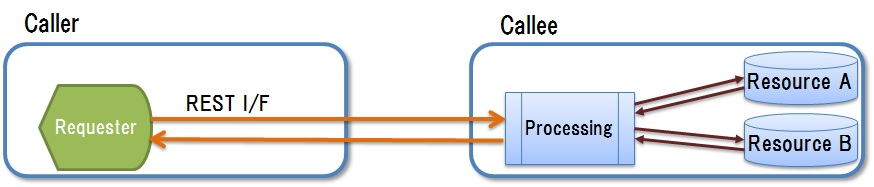
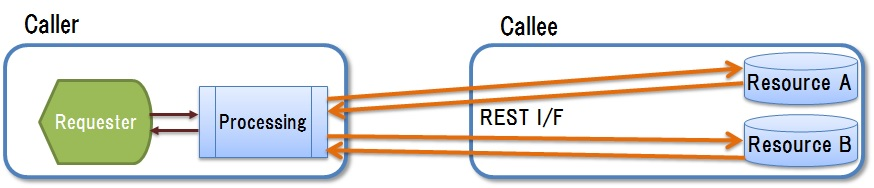

# 3. Using the Standard Interface

## <a name="init">3.1. Introduction</a>
### 3.1.1. Main points
　This section explains the following points in detail.
 
* The approach of using a standard interface for connection of the constituent components of a system and for interworking with other systems
* The use of a REST-ful interface as the standard interface. A policy for using REST-ful interfaces.

 
### 3.1.2. Abbreviations
　The abbreviations used in this section are explained in the following table. 
 
| Abbreviation | Meaning |  
|---|---|  
| I/F | InterFace |
| REST | REpresentational State Transfer |
| HTTP | HyperText Transfer Protocol |
| URI | Universal Resource Identifier |
| CRUD | Create/Read/Update/Delete |

## <a name="purpose">3.2. Purpose</a>
　The purpose of this section is to propose the use of an interface for implementing the items listed below.
 
* Systems based on a [loosely-coupled architecture](guideline_loosely-coupled-architecture.md)
* Easy combination of elements when constructing a system that combines elements that have differing implementation methods, even without awareness of the differences in the implementation method of individual elements. 
* A unified interface for access to other systems when implementing interworking without awareness of the internal structure of the other systems or changes in them

## <a name="policy">3.3. Policy</a>
　To achieve [the purpose](#purpose), we introduce a universal interface that has a long lifetime and provides a common approach and specifications that are independent of the individual systems and their components.

 
## <a name="standard-if">3.4. The standard interface</a>
　According to [the policy](#policy), we introduce a standard interface that has the following features.  

* In these guidelines, the standard interface is defined as an interface that satisfies the conditions listed below.

	* The interface procedure and format for specifying the call address shall be common.
	* The content of operations implemented by calling individual interfaces shall be the same regardless of the destination for the call.
	* It shall be possible to use the interface over a long time period.
	
* The source of the standard interface call shall understand the interface operations, but require no knowledge of the implementation method or detailed specifications of the destination of the call.
* It shall be possible to combine elements that have different forms of implementation by using the standard interface to interconnect the elements within a system as well as loosely-coupled constituent elements. (See section 2, ['Introducing the Loosely-coupled Architecture'](guideline_loosely-coupled-archit３ecture.md)).

 
## <a name="if-impli">3.5. Implementation policy for the standard interface</a>
### 3.5.1. Use of REST
　REST is a distributed system network architecture style. For more information on REST, refer to the source listed below or various other resources.
    
　 [Roy Fielding, "Architectural Styles and the Design of Network-based Software Architectures, Chapter 5"](http://www.ics.uci.edu/~fielding/pubs/dissertation/rest_arch_style.htm)   
 
　For the reasons listed below, a REST-ful interface as defined in section 3.4, ['The Standard interface'](#standard-if) is used for the standard interface.
 
* As described above, there is a common specified format for calls with the interface and the operations are unified.
  * Information that can be used within a system is handled as a call destination (resource).
  * Specific operations are executed for resources (URI) (GET, POST, PUT, and DELETE: send requests and receive responses).

* Being based on the generally-used HTTP protocol makes the interface relatively simple, and long-term applicability is ensured because it is not necessary to select a particular element implementation method.

### 3.5.2. Operations performed with the interface
　The operations of a REST-ful interface are listed below.   
 
**(1)Types of operations**    
　The operations of a REST-ful interface (GET, POST, PUT, and DELETE) and [the loosely-coupled architecture](guideline_loosely-coupled-architecture.md) processing that corresponds to each operation is described in the following table.      
 
| Operation | Description of operation on the resource | Processing in a loosely-coupled architecture |    
|---|---|---|   
| GET | Retrieves a resource | - The UI or other system retrieves data from a data repository.|   
| POST | Creates a new resource | - The UI or other system creates a new data entry in the data repository. - The UI or other system requests the execution of processing for a job. |   
| PUT | Updates a resource | - The UI or other system updates data that is in the data repository. |   
| DELETE | Deletes a resource | - The UI or other system deletes data from the data repository. |   

*[Example: The UI or other system requests the execution of processing and retrieval of the processing results]*  
　Conventionally, the processing results are retrieved as one response to one processing request.     
 　However, when using the REST-ful interface from the above table, we use the two-step procedure listed below to split the processing request and the result retrieval into two operations.     

1. The UI or other system requests processing for a job. (POST)
2. The UI or other system retrieves processing results from a data repository.(GET)

**(2)Processing approach for implementing interface operations**    
 　The processing implementation patterns for implementing the operations of a REST-ful interface fall into two broad types as described in the following table.  
  

|#| Processing implementation pattern | Description | 
|---|---|---|
|1| Indirect access |- The operation on the resource is performed as indirect access via processing (CRUD) executed on the resource by the call destination. - The pattern is outlined in [Fig. 1](#fig1).|    
|2| Direct access |- The operation on the resource is performed as direct access processing (CRUD) by the interface caller on a resource of the callee. - The pattern is outlined in [Fig. 2](#fig2)|

  　　
 
    
　<a name="fig1">Figure 1: Indirect access processing implementation pattern</a>
 　

    
　<a name="fig2">Figure 2: Direct access processing implementation pattern</a>
   
   
　From the perspective of ensuring resource compatibility with the operation, operations performed with a REST-ful interface shall be implemented according to the policy described below. By doing so, the processing implementation patterns for the operations of the REST-ful interface are assigned as shown in the following table.   
 
* For the operations that affect a resource (POST, PUT, and DELETE), access processing to the resource is permitted only from within the interface caller.
* For the operation that does not affect the resource (GET), access processing to the resource is permitted both from within the interface caller and from outside the caller.
 
|#| Processing implementation pattern | GET | POST | PUT | DELETE |
|---|---|---|---|---|---|
|1| Indirect access |✔|✔|✔|✔|    
|2| Direct access |✔|　|　|　|    
  
* Which of the two processing implementation patterns is to be used for the GET operation is determined by the requirements of the application, such as those listed in the following table.
 
 
|#| Processing implementation pattern | Corresponding requirements |   
|---|---|---|   
|1| Indirect access | - Data in a global shared processing scheme is used. - Development is controlled globally.|  
|2| Direct access | - Data in a local processing scheme is used. - Programs are developed and maintained locally. |   
 
 

 

 

* * *
[**Table of contents**](guideline_summery-e.md#guideline-contents)    
[**Glossary**](guideline_glossary-e.md)     
[**Cautions**](guideline_caution-e.md)

