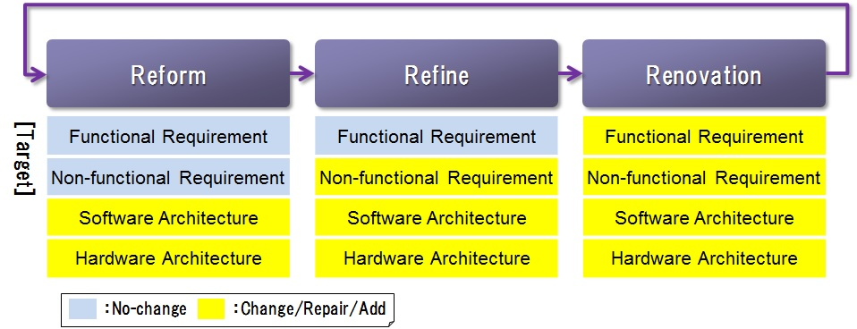
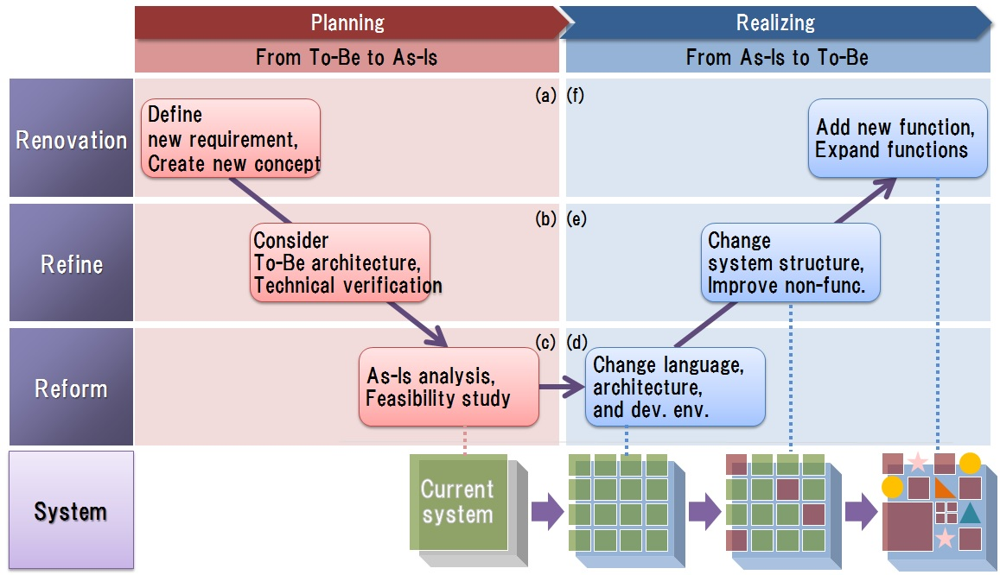

# 1. システムリノベーション

## <a name="init">1.1. はじめ</a>
### 1.1.1. 本章のポイント
　本章では以下の内容について説明します。詳細は以降にて説明します。

### 1.1.2. 略語
　本章にて使用する略語を以下に挙げます。 
 
| 略語 | 説明 |  
|---|---|  
|R3|Reform, Refine, Renovation|
|UT|Unit Test|
|CT|Combination Test|
|DB|DataBase|
 
 
## <a name="purpose">1.2. 目的</a>
　ガイドライン全体の理解を深めるために，グローバル標準化システムを開発する上で前提となる考え方を示すことを本章の目的とします。

　本ガイドラインが対象とするシステムは，以下のような特徴を持ちます。
 
* 数十年間という長期に渡り運用してきたシステムであり，システムの停止や変更が多くの人の業務に影響を与える重要なシステムです。
* 数十年かけて開発保守してきたため規模が大きく，システム全体を把握することが困難であり，仕様の不足やソースコードと仕様書との乖離がある可能性があります。
* ローカルサイトの業務に合わせてシステムを最適化し，本質的には同じ業務を支援するシステムであっても，サイト間のシステムの細かい仕様は異なることが多々あります。

　上記のようなシステムをグローバル標準化システムとして最新IT技術で開発するためにはいくつかアプローチが考えられますが，
次々世代のシステム刷新まで考慮し，時代に合った最新技術で開発保守しやすいシステムを構築するためには，
刷新に伴うリスクを最小化し，段階的かつ継続的に開発していくアプローチが有効です。
モダンな技術でシステムを刷新することに主眼を置いてしまうと，保守性が低く，長年蓄積してきたリスク回避の施策を破棄することになりかねません。    
　そこで，本ガイドラインではシステムリノベーションを適用することにより，これまでシステムに蓄積してきた先人の工夫や知見を生かし，
変更リスクを極小化した上で継続的システム刷新を実現します。

## 1.3. 開発方針
### 1.3.1. システムリノベーションの考え方
　システムリノベーションとは，下表に挙げるReform，Refine，Renovationの3つのプロセスでシステムを抜本的に刷新するシステム開発の考え方です。これら3つのプロセスのことをR3プロセスと呼びます。

|プロセス|説明|
|---|---|
|Reform|提供するサービスやシステムの構造は変えず，ハードウェアやソフトウェアアーキテクチャを変更することにより，システムの基盤部分の変更容易性を改善します。|
|Refine|提供するサービスやシステムの構造は変えず，ハードウェアやソフトウェアアーキテクチャを変更することにより，システムの基盤部分の変更容易性を改善します。|
|Renovation|先人の知見は生かしつつ，システムの抜本的な刷新や新たなサービスを実現します。|

　これら3つのプロセスは互いに関連しており，システムの状態によって適切なプロセスを適用することにより，総合的に効率の良いシステム刷新を実現します。

　<a name="fig1">図1：システムリノベーション</a>

### 1.3.2. システムリノベーションの適用効果

システムリノベーションを適用することにより，システム刷新において以下の実現を目指します。

 - 長年蓄積してきた大規模な既存システムの原理原則を生かして効率的にシステムを刷新すること
 - 業務に与える影響を考慮し，現行の機能性を保証しつつシステムを刷新すること
 - 大規模かつ数年に一度の刷新ではなく，継続的にシステムを進化し続けられる基盤を構築すること

## 1.4. リノベーションプロセスの詳細

　環境や事業構造などが変化し続ける社会において，その変化に柔軟に対応するためには，システム刷新を段階的かつ継続的に実施することが重要です。

　そこで，システムリノベーションではシステム刷新のフェーズを3つのプロセスとして定義し，段階的かつ継続的に各プロセスを実施してシステムを進化させることにより，改善効果を明確にしながらシステムの刷新を支援します。

　[図2](#fig2)にR3プロセスとシステムの進化の関係性を示します。
 
* 重要なことは，各プロセスは一度に実施するのではなく段階的に実施することです。
* Reformから着手するのではなく，計画フェーズと実現フェーズとに分けます。計画フェーズではRenovationから現行システムにとらわれないTo-Beシステムのあるべき姿を描いてから現行システムの刷新計画を立てていきます。

　<a name="fig2">図2：R3プロセス</a>

　以降では，計画フェーズと実現フェーズに分けて，図2に示したReform,Refine,Renovationの各プロセスの具体例を示します。

### 1.4.1. 計画フェーズ

**(a) Renovation**   

　まず，Renovationでは，To-Beとしてあるべきシステム像を描き，要件を抽出します。具体例として，以下の取組みを実施します。
 - CoEコンセプトの創出
 - グローバル標準化システムのコンセプト導出

**(b) Refine**     

　Refineでは，(1)Renovationで定義したコンセプトやあるべき像を元に，具体的なシステムの要件やアーキテクチャの検討をします。
具体例として，以下の取組みを実施します。

 - グローバル標準化システムのアーキテクチャ検討（疎結合化アーキテクチャ）
 - PoCを通じた技術検証

**(c) Reform**   

　Reformでは，(1)Renovation及び(2)Refineで検討したシステムの実現に向けた現行システムの把握及び不ィージビリティスタディとリノベーション計画策定を行います。
具体例として，以下の取組みを実施します。
 - リノベーション適用対象システムの把握
     - システムの全量（総ステップ数，総ファイル数，など）
     - 刷新対象システムのシステム構造分析
     - 対象システムの関連性分析
 - アーキテクチャの適用範囲検討
 - 実行計画策定

### 1.4.2. 実現フェーズ

**(d) Reform**    

　実現フェーズのReformでは，計画フェーズで策定した実行計画に基づきアーキテクチャや環境を変更します。
　なお，提供するサービス・システムの構造は変わりません。具体例として，以下の取組みを実施します。

 - システム構造把握
 - 実装言語変換（例：cobol to java）
 - インフラ環境の変更
 - 継続的インテグレーション/継続的デプロイ環境の導入
 - 標準インタフェースを用いた疎結合化アーキテクチャへの切り替え

**(e) Refine**    

　Refineでは，提供するサービスすなわち機能性を維持した状態で，非機能要件を改善します。
具体例として，以下の取組みを実施します。

 - リファクタリング
 - イベントドリブンアーキテクチャの適用
 - セキュリティフレームワーク適用によるセキュリティ向上
 - DB標準化等の取組みによる処理性能向上
 - UT/CTに影響ない範囲でのDB構造変更

**(f) Renovation**    

　Renovationでは，システム構造や業務プロセスに組み込まれている先人の知見は生かしつつ，システムの抜本的な刷新や新たなサービスを実現します。
具体例として，以下の取組みを実施します。

 - 新規機能の追加
 - サービスのリデザイン

### 1.4.3. 各プロセスの効果

 リノベーションプロセスの各プロセスの効果を[図3](#fig3)に示します。

* Reformにおける効果は開発者/保守者にとって変更容易性が高まることです。
	* 高い変更容易性を実現することにより，段階的かつ継続的なシステムの変更が可能になり，各変更にかかるコストが低下します。

* RefineではReformで実現した変更容易性の高い環境を用いて，機能性を変えずにシステムの改善を行います。
	* 処理時間の短縮やユーザからの性能改善要求に早く応えられるようになり，特に待ち時間が発生していた業務の効率を改善します。
	* システムの実装が整理されることにより，保守性や開発効率の向上も期待できます。

* Renovationでは，Refineまでで実現した基盤を元に新たなサービス創生を行うことで，ユーザの業務を革新します。
	* 業務は環境や状況により変化していきますが，その変化に継続的に追従し，新たなサービスの実現を支援するシステムを実現します。

　<a name="fig3">図3：R3プロセスの効果</a>

## 1.5. 本ガイドラインの構成

2章以降では，システムリノベーションの各プロセスの具体例としてあげた技術要素について詳細説明をします。
 - Reform
   - [2. 疎結合化アーキテクチャ導入](guideline_loosely-coupled-architecture.md)
   - [3. 標準インタフェース活用](guideline_unified-standard-interface.md)
   - [5. 継続的インテグレーション](guideline_continuous-integration.md)

 - Refine
   - [4. バッチフレームワークを用いたアプリケーション開発](guideline_batch-framework.md)

 - Renovation
   - [6. システムリソース管理](guideline_system-resource-mgt.md)

* * *
[**目次**](guideline_summery.md#guideline-contents)    
[**用語集**](guideline_glossary.md)     
[**注意事項**](guideline_caution.md)