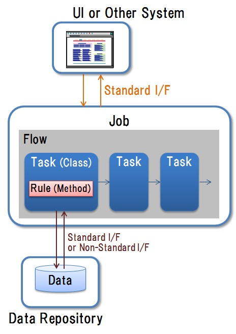

# 2. 疎結合化アーキテクチャ導入

## <a name="init">2.1. はじめに</a>
### 2.1.1. 本章のポイント
　本章では以下の内容について説明します。詳細は以降にて説明します。
 
* システムを，業務向けのUIを実装する要素，個々の処理ロジックを実装する要素，データモデルに基づくデータを保持する要素の3種類として分離し，これらの組合せによりシステム及び業務を構成するという，疎結合化アーキテクチャについて説明します。
* 疎結合化した要素はマイクロサービスに相当するものです。マイクロサービスの考え方を踏まえての疎結合化した要素の考え方について説明します。
 
### 2.1.2. 略語
　本章にて使用する略語を以下に挙げます。 
 
| 略語 | 説明 |  
|---|---|  
| UI | User Interface | 
| I/F | Interface |
| DB | Data Base |
| PCS | Production Control System |

## <a name="purpose">2.2. 目的</a>
　本章の目的は，以下を実現するためのアーキテクチャを提案することです。

*  グローバルに展開するシステムを対象として，グローバルに共通する機能の活用と，拠点毎に内容や実行順番の異なる業務処理の組合せによるシステムの構築を容易化します。
* 改修もしくは障害発生時の影響範囲を最小化させ，影響範囲の特定も容易化します。    

## <a name="policy">2.3. 方針</a>
　[目的](#purpose)を達成する上で，下表にまとめるように，As-Isシステムでは，モノリスな構成となっており，処理とデータが密結合であるため，改修もしくは障害発生時の影響範囲の特定が困難でした。これに対してTo-Beシステムとして，システムの構成要素を分離し，それらを統一の標準インタフェースを介して接続することで疎結合な構成とするアーキテクチャを実現します。
 

| 対象 | アーキテクチャ | 概要 |
|---|---|---|
| As-Is System (Monolith) | ・処理とデータが密結合。 ・システム毎に個別インタフェース使用。 | |
| **To-Be System** | **・システムの構成要素（処理，データ，UI）を分離，疎結合化。 ・統一の標準インタフェースを介して構成要素間を接続** | |
    
 
## <a name="archi">2.4. アーキテクチャの基本原理</a>
　[方針](#policy)に従い[図1](#fig1)に示すように，以下のような特徴を備えることでシステムの構成要素が疎結合化されるアーキテクチャを提案します。  
 
* システムを下表の分類による要素に分離します。個々の要素は，特定の機能または一連の機能を実行するものであり，ソフトウェアプログラムとして実現されます。

    | 分類 | 説明 | 備考 |  
    |---|---|---|  
    | ジョブ | 個々の処理ロジックを実装する要素 | 現行PCSでのメインシェルに該当。詳細は[「2.5.2. 疎結合化した要素の定義」](#module-def)参照|    
    | UI | 業務向けのUIを実装する要素 | |
    | データリポジトリ | データモデルに基づくデータを保持する要素 | |

* 個々の要素は，開発，管理しやすい単位で区切ります。詳細は[「2.5. 疎結合化した要素の考え方」](#module-design)にて述べます。   
* 基本的に全ての要素間では統一した標準インタフェースを介して相互接続します。標準インタフェースの詳細については[「3. 標準インタフェース活用」](guideline_unified-standard-interface.md)にて述べます 
* ただし同一システム内で性能，伝送データサイズ等を考慮する場合は，非標準インタフェースを使用することも可能です。
* 他システムからも標準インタフェースを介して，ジョブ，データリポジトリを呼び出すことを可能とします。  
* システムを構成する要素を全て同一の言語もしくは同一の技術を用いて作成する必要はありません。同一システム内でも，要素毎に異なる言語もしくは異なる技術を用いることも可能です。
* システム及び業務は上記による１つ以上の要素の組合せで構成するものとします。
* 疎結合化した要素の単位にて，実装，テスト，デプロイを実施することを可能とします。  
* 改修や入替は要素の単位で実施することとし，改修もしくは障害発生時の影響範囲を最小化させ，特定も容易とさせます。

    
　<a name="fig1">図1：疎結合化アーキテクチャ</a>

## <a name="module-design">2.5. 疎結合化した要素の考え方</a>
　[疎結合化アーキテクチャ](#archi)における疎結合化した要素は，以下に述べるマイクロサービスの考え方，疎結合化した要素の定義，実装方針に従って作成するものとします。
### <a name="microservice">2.5.1. マイクロサービス</a>
　[疎結合化アーキテクチャ](#archi)における疎結合化した要素については，マイクロサービスの考え方が参考になります。
 
* マイクロサービスの定義については以下の資料を参照して下さい。　　    
 　[James Lewis, Martin Fowler, "Microservices"](http://martinfowler.com/articles/microservices.html)    
* [疎結合化アーキテクチャ](#archi)における疎結合化した要素は，マイクロサービスに相当する単位です。つまり開発してデプロイする単位であり，標準インタフェースを介して呼び出される単位であります。

* 疎結合化した要素の粒度については注意が必要です。要素を細かくしすぎると，保守運用の観点の管理が煩雑となります。また標準インタフェースを介してのアクセスコストが増加します。

### <a name="module-def">2.5.2. 疎結合化した要素の定義</a>
　[疎結合化アーキテクチャ](#archi)において導入する３種類の要素は，[マイクロサービス](#microservice)の考え方を踏まえて，以下のように定義します。

**(1) ジョブ**    
　ジョブは以下のように定義します。[図2](#fig2)に概要を示します。　　　

* ジョブは，業務を実施する上での，システムにおける完結した機能の単位とします。    
* ジョブは，他システムや他要素から標準インタフェースを介して呼び出される単位です。    
* ジョブは，1つ以上のフローの集合とします。   
  
　ジョブを構成するフローは，以下とします。   
 
* フローは，1つ以上のタスクの集合とします。   
* ジョブの実行は，フローを構成するタスクを順次実行することにより達成されます。フローはジョブを構成するタスクの実行の順序や条件を定義します。フローに従ってタスクを実行します。   
  
　フローを構成するタスクは，以下とします。   
 
* タスクは，業務を実施する上でのシステムにおける機能のサブ機能となる単一トランザクションの単位であり，再利用可能な最小の単位とします。つまりプログラムとして再利用するのは，ジョブ(タスク，フロー含む)，フロー(タスク含む)，タスクのみのいずれかの単位までとします。    
* タスクは，上記サブ機能の処理ロジックとなるルールを含みます。タスク内のルール間で依存性が高いため，ルールの単位での再利用は行いません。    
* タスクの単位で，データリポジトリに対してデータアクセスを行います。　　　　
  
　以下に，ジョブ及びタスクの一例（生産管理システムの場合）を挙げます。
 
* ジョブ　：生産計画立案
* タスク　：月次オーダー受信・取込，月次計画作成，日次スケジュール作成

　ジョブ，フロー，タスクの各要素と，現行PCSでの該当する構成要素との対応付けを下表にまとめます。
 
| 要素 | 現行PCSでの該当する要素 |   
|---|---|   
| ジョブ | メインシェル |  
| フロー | サブシェル |  
| タスク | プログラム，コマンド |  

 
    
　<a name="fig2">図2：ジョブの定義</a>
 
**(2) UI**    
　UIは以下のように定義します。    
 
* 業務にて用いる操作画面，情報表示画面，等の完結したUIを提供します。
* 標準インタフェースのみを介して，ジョブもしくはデータリポジトリを呼び出します。

**(3) データリポジトリ**    
　データリポジトリは以下のように定義します。    
 
* システムにて使用するデータを保持します。
* 保持するデータは，システムにて定める共通のデータモデルに準拠するものとします。
* 標準インタフェースを介して，他要素（ジョブ，UI）もしくは他システムに対して，データリポジトリが保持するデータへのアクセスを行わせます。
* ジョブからは標準インタフェースだけでなく，個別インタフェースを介してのデータアクセスも行わせます。

### <a name="module-impli">2.5.3. 疎結合化した要素の実装方針</a>

　疎結合化した要素は以下の方針に従って実装するものとします。なおジョブの実装方法の詳細は[「4. バッチフレームワークを用いたアプリケーション開発」](guideline_batch-framework.md)にて述べます。

**(1) ジョブ**    
* ジョブは，１つ以上の処理のまとまりである*ジョブ*として実装します。処理の実行の順序や条件の定義であるフローを含みます。
* ジョブ，フローを構成するタスクは，*クラス*として実装します。
* タスクにおけるルールは，クラスの*メソッド*として実装します。
* タスク（クラス）の処理のインプットデータ及びアプトプットデータ，処理にて参照するパラメタデータは全てデータリポジトリに格納します。
 
**(2) UI**    
* システム，業務にて定める技術を用いてUIを実装します。
* 標準インタフェースのみを介して，ジョブの処理呼び出しもしくはデータリポジトリへのデータアクセスを行い，実行結果を取得します。実行結果の加工等を行い画面表示をします。

**(3) データリポジトリ**    
* DB，ファイル等を用いてデータを保持します。
* 標準インタフェースに対する保持データへのアクセス処理を実装します。
* 同一計算機内で稼働するジョブ向けに，個別インタフェースによるアクセス処理を実装します。

* * *
[**目次**](guideline_summery.md#guideline-contents)    
[**用語集**](guideline_glossary.md)     
[**注意事項**](guideline_caution.md)
