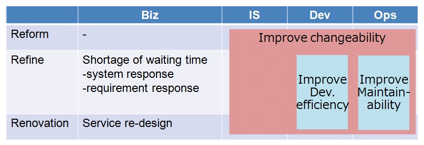

# 1. システムリノベーション

## <a name="init">1.1. はじめに</a>
### 1.1.1. 本章のポイント
　本章では以下の内容について説明します。詳細は以降にて説明します。
 
* 長期に渡り運用されているシステムを対象として，変更リスクを最小化して，継続的に刷新していくための，システムリノベーションの考え方について説明します。
* システムリノベーションを構成する3つのプロセス(Reform，Refine，Renovation)に沿って，システムの刷新を進めていくためのアプローチについて説明します。

### 1.1.2. 略語
　本章にて使用する略語を以下に挙げます。 
 
| 略語 | 説明 |  
|---|---|  
|R3|Reform, Refine, Renovation|
|UT|Unit Test|
|CT|Combination Test|
|DB|DataBase|
|PoC|Proof of Concept|
|Biz|Business User|
|IS|Information System Division's User|
|Dev.|Developer|
|Ops.|Operations User| 
 
## <a name="purpose">1.2. 目的</a>
　ガイドライン全体の理解を深めるために，グローバル標準化システムを開発する上で前提となる考え方について述べることを本章の目的とします。     
　本ガイドラインで開発対象とするシステムは，以下のような特徴を持ちます。

* 数十年間という長期に渡り運用してきたシステムであり，システムの停止や変更が多くの人の業務に影響を与える重要なシステムです。
* 数十年かけて開発・保守してきたため規模が大きく，システム全体を把握することが困難であり，ドキュメントの不足やソースコードとドキュメントとの乖離がある可能性があります。
* 拠点毎のローカルな業務に合わせてシステムを最適化し，本質的には同じ業務を支援するシステムであっても，拠点間でシステムの細かい仕様は異なることがあります。

 
## <a name="policy">1.3. 方針</a>
　[「1.2. 目的」](#purpose)にて述べたようなシステムをグローバル標準化システムとして，時代に合った技術を駆使して開発するためには幾つかのアプローチが考えられますが，流行の技術を駆使してシステム刷新することに主眼を置いてしまうと，保守性が低く，長年蓄積してきたリスク回避の施策を破棄することになりかねません。    
　一方で，現行システムの実装技術に固執してしまうと，グローバルでの開発者リソースの確保が難しくなります。

　次々世代のシステム刷新までを考慮し，開発・保守しやすいシステムを構築するためには，これまでシステムに蓄積してきた先人の工夫や知見を生かしてシステムの変更に伴うリスクを最小化し，段階的かつ継続的に開発していくアプローチが有効です。    
　そこで，本ガイドラインではシステムリノベーションを適用することにより，効率的なシステム開発を実現するための考え方について説明します。

## <a name="renovation">1.4. システムリノベーションの考え方</a>
### 1.4.1. コンセプト
　環境や事業構造等が変化し続ける社会において，その変化に柔軟に対応するためには，システム刷新を段階的かつ継続的に実施することが重要です。

　システムリノベーションとは，下表に挙げるReform，Refine，Renovationの3つのプロセスでシステムを段階的に刷新するシステム開発の考え方です。これら3つのプロセスのことをR3プロセスと呼びます。

|プロセス|説明|
|---|---|
|Reform|提供するサービスやシステムの構造は変えず，ハードウェアやソフトウェアアーキテクチャを変更することにより，システムの基盤部分の変更容易性を改善します。|
|Refine|提供するサービスは変えず，ハードウェアやソフトウェアアーキテクチャ，システムの構造を変更することにより，システムの非機能要件や保守性を改善します。|
|Renovation|先人の知見は生かしつつ，システムの抜本的な刷新や新たなサービスを実現します。|

　システムの状態によって適切なプロセスを適用し，段階的かつ継続的に各プロセスを実施してシステムを刷新させることにより，改善効果を明確にしながらシステムの刷新を実現します。

　<a name="fig1">図1：システムリノベーション</a>

### 1.4.2. 適用効果

システムリノベーションを適用することにより，システム刷新において以下の実現を目指します。

 - 長年蓄積してきた既存システムに関する知見を活かして効率的にシステムを刷新すること
 - 業務に与える影響を考慮し，現行の機能性を担保しつつシステムを刷新すること
 - 大規模かつ数年に一度の刷新ではなく，継続的にシステムを刷新し続けられる基盤を構築すること

## <a name="r3">1.5. リノベーションプロセスの詳細</a>

　[図2](#fig2)にR3プロセスとシステム刷新の関係性を示します。
 
* 重要なことは，各プロセスは一度に実施するのではなく段階的に実施することです。
* まずReformから着手するのではなく，計画フェーズと実現フェーズとに分けます。計画フェーズでは，Renovationから現行システムに囚われないTo-Beシステムのあるべき姿を描いてから現行システムの刷新計画を立てていきます。

　<a name="fig2">図2：R3プロセス</a>

### 1.5.1. 各プロセスの具体例

　計画フェーズと実現フェーズに分けて，[図2](#fig2)に示したReform，Refine，Renovationの各プロセスの具体例を示します。

**(a) 計画フェーズ： Renovation**   

　計画フェーズのRenovationでは，To-Beとしてあるべきシステム像を描き，要件を抽出します。   
　具体例として，以下の取組みを実施します。

 - To-Beシステムの要件の整理
 - グローバル標準化システムの新しいコンセプト導出

**(b) 計画フェーズ： Refine**     

　計画フェーズのRefineでは，(a)Renovationで定義したコンセプトやあるべき像を元に，具体的なシステムの要件やアーキテクチャの検討をします。    
　具体例として，以下の取組みを実施します。

 - グローバル標準化システムのアーキテクチャ検討（疎結合化アーキテクチャ）
 - PoCを通じた技術検証

**(c) 計画フェーズ： Reform**   

　計画フェーズのReformでは，(a)Renovation及び(b)Refineで検討したシステムの実現に向けた，現行システムの把握及びフィージビリティスタディとリノベーション計画策定を行います。    
　具体例として，以下の取組みを実施します。
 - リノベーション適用対象システムの把握
     - システムの全量（総ステップ数，総ファイル数，等）
     - 対象システムのシステム構造及び構文
     - 対象システムの関連性
 - アーキテクチャの適用範囲検討
 - リノベーション実行計画策定

**(d) 実現フェーズ： Reform**    

　実現フェーズのReformでは，計画フェーズで策定した実行計画に基づきアーキテクチャや環境を変更します。なお，提供するサービス(機能性)やシステム構造は変わりません。   
　具体例として，以下の取組みを実施します。

 - 実装言語の変換（例：cobol to java，VB to JS）
 - インフラ環境の変更
 - 継続的インテグレーション及び継続的デプロイの環境導入
 - 新しいアーキテクチャ(疎結合化アーキテクチャ)への切り替え

**(e) 実現フェーズ： Refine**    

　実現フェーズのRefineでは，提供するサービスすなわち機能性を維持した状態で，非機能要件を改善します。    
　具体例として，以下の取組みを実施します。

 - リファクタリング
 - バッチフレームワーク適用によるイベントドリブン実現
 - セキュリティフレームワーク適用によるセキュリティ向上
 - DB標準化等の取組みによる処理性能向上
 - UT/CTに影響の無い範囲内でのDB構造変更

**(f) 実現フェーズ： Renovation**    

　実現フェーズのRenovationでは，システム構造や業務プロセスに組み込まれている先人の知見を活かしつつ，システムの抜本的な刷新や新たなサービス(機能性)を実現します。    
　具体例として，以下の取組みを実施します。

 - 新規機能の追加
 - サービスのリデザイン

### 1.5.2. 各プロセスの効果

 リノベーションプロセスの各プロセスの効果を[図3](#fig3)に示します。

* Reform
	* システムの変更容易性を高める基盤を実現することで段階的かつ継続的なシステムの変更が可能になり，開発者や保守者による各種の変更作業にかかる工数を削減できます。

* Refine
	* 変更容易性の向上に伴い処理時間の短縮や性能改善要求に開発者が早く応えられるようになるため，ユーザは特に待ち時間が発生していた業務の効率が改善されます。
	* システムの実装が整理され視認性が向上することにより，開発者や保守者が開発・保守をしやすくなります。

* Renovation
	* 業務は環境や状況により変化していきますが，その変化に継続的に追従し，新たなサービスの実現を支援するシステムを実現することにより，ユーザの業務を革新できます。

　<a name="fig3">図3：R3プロセスの効果</a>

## <a name="others">1.6. 他章との関係</a>

　2章以降では，システムリノベーションの各プロセスの具体例としてあげた技術要素について詳細に説明します。
 - Reform
   - [2. 疎結合化アーキテクチャ導入](guideline_loosely-coupled-architecture.md)
   - [3. 標準インタフェース活用](guideline_unified-standard-interface.md)
   - [5. 継続的インテグレーション](guideline_continuous-integration.md)

 - Refine
   - [4. バッチフレームワークを用いたアプリケーション開発](guideline_batch-framework.md)

 - Renovation
   - [6. システムリソース管理](guideline_system-resource-mgt.md)

* * *
[**目次**](guideline_summery.md#guideline-contents)    
[**用語集**](guideline_glossary.md)     
[**注意事項**](guideline_caution.md)

