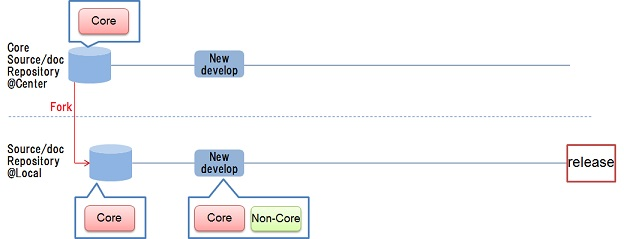
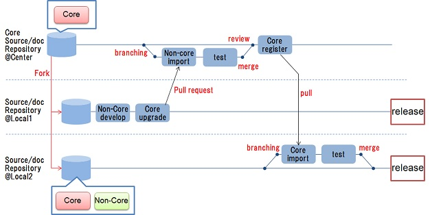

# 6. システムリソース管理

## <a name="init">6.1. はじめに</a>
### 6.1.1. 本章のポイント
　本章では以下の内容について説明します。詳細は以降にて説明します。
 
* グローバルに規定した標準に従いながら，ローカルの要件にも合致したシステムを開発，運用するための，システムリソース管理の考え方について説明します。
* システムリソース管理を実施する上で必要となる，管理すべき対象を明確に把握するための，リソース可視化の考え方について説明します。
* システムリソース管理を実施する上で必要となる，システム構造を維持するための，統制の考え方について説明します。
 
### 6.1.2. 略語
　本章にて使用する略語を以下に挙げます。 
 
| 略語 | 説明 |  
|---|---|  
| UI | User Interface | 

## <a name="purpose">6.2. 目的</a>
　本章の目的は，以下を実現するためのシステムリソース管理の考え方を提案することです。
 
* [疎結合化アーキテクチャ](guideline_loosely-coupled-architecture.md)に基づくシステムをグローバルに展開する場合に，グローバルに規定された標準に従いながら，ローカルの要件にも合致させて，個々のローカルにて開発，運用することを容易にします。
* システムの開発及び改修において，構成要素の再利用性を高くして，システム開発及び改修の生産性を向上させます。

## <a name="policy">6.3. 方針</a>
　本ガイドラインが対象とする，企業の基幹システムでも従来からのものは，規模が大きく，これまで長期間に渡り，個々の拠点にて個別に継ぎ足し開発を続けてきたものが多いです。このためシステムの全体像把握が困難であり，ソースコードの再利用性も高くありませんでした。    
　そこで[目的](#purpose)を達成するために，グローバルのシステム間での構成要素の共通部分や関係性を明確化し，維持管理するための考え方を提案します。また上記管理の対象となるシステムの構造を維持するために開発統制をとるための考え方についても提案します。
 
## <a name="system-resource">6.4. システムリソース管理の考え方</a>
　[方針](#policy)から，以下のような特徴を備えるシステムリソース管理を実現します。 
 
* リソースとは，システムを設計，実装，テスト，リリースする各フェーズにおいて必要とするもののことを指します。下表にリソースの例を挙げます。
* システムリソース管理とは，上記のリソースをグローバルで一元的に管理することです。つまりグローバルでの共通のリソースは共通性を維持すべく管理，統制を行い，個々の拠点のローカル要件を反映したリソースは，システムの標準構成を維持するために共通リソースや他のリソースとの関係を明確化した上で管理します。
* リソースの中でも，システム構成要素のソースコードと関連する設計ドキュメントの内容との整合性を保つことが重要です。これにより，ソースコードの内容の正しい理解を促進し，ソフトウェアプログラムの品質を保つ上で有用となります。
* システムリソース管理を実施する上で，以下の2つが必要となります。これらの詳細は次節以降で述べます。
	* [リソース可視化](#resource-vs)：管理すべき対象を明確に把握するため
	* [統制](#control)：システム構造を維持するため

|#|分類|リソース項目|
|---|---|---|
|1|環境|環境コード，環境構築ファイル|
|2|ドキュメント|ガイドライン，マニュアル，設計ドキュメント|
|3|システム構成要素|テンプレート，ソースコード生成スクリプト，ソースコード，データスキーマ|
|4|テスト|テストコード，テストデータ|

 
## <a name="resource-vs">6.5. リソース可視化の考え方</a>
　システムに関連する管理すべき対象を明確にするために，以下のようにしてリソース可視化を行います。   
 
* リソースに関して可視化する項目を下表及び[図1](#fig1)に挙げます。[「6.4. システムリソース管理の考え方」](#system-resource)にて述べたあらゆるリソースに関して可視化すべきです。ただここでは特にシステム構成要素を例に挙げて説明します。
* 可視化」とは，下表に挙げた対象，関係性，プロパティを，図，グラフ，表，等の形式にして人が視覚的に見ることが出来るようにすることです。
* 下表及び[図1](#fig1)に挙げる内容でリソース可視化を実施することで，個々の要素だけでなくシステムや業務フローの全体像や状態の把握が容易となり，システムの統制や問題点分析，改善検討，等の際に有用となります。

|#|項目|説明|
|---|---|---|
|1|対象|・システム及び業務フローを構成する要素を可視化します。 ・可視化する要素として例えば，UI等の業務オペレーション，ジョブ及びジョブを構成するタスク，タスクの動作に影響を与えるパラメタ等があります。|
|2|関係性|・対象間の関係性を可視化します。 ・例えば，業務オペレーションにて呼び出すジョブ，タスクにて参照するパラメタ，等の関係です。|
|3|プロパティ|・対象の属性を可視化します。 ・例えば，業務オペレーションの実行回数，タスクの実行状態，パラメタの参照回数，等です。|

     
　<a name="fig1">図1：リソース可視化</a>
 
 
## <a name="control">6.6. 統制の考え方</a>
　新規開発や改修実施に関わらず，システムの構造を維持するために，以下のようにして統制を行います。   
 
 
* システムに対する改修責任の範囲や管理権限を明確にするために，システムにおけるグローバルに共通な部分と拠点毎の仕様に基づく個別部分とを区分します。
	* 共通部分を"Core"，個別部分を"Non-Core"として，下表のように定義します。
	* [「6.4. システムリソース管理の考え方」](#system-resource)にて述べたリソースに対して，Core/Non-Coreを識別して管理します。

|項目|説明|導入条件|改修責任|管理権限|
|---|---|---|---|---|
|Core |グローバル標準のシステム共通部分|必須|中央(統括部門)|中央(統括部門)|
|Non-Core|各拠点の仕様に基づく個別部分|一任|各拠点|各拠点|

* Core及びNon-Coreのリソースは各拠点のシステムにて活用されるものですが，Core/Non-Coreの区分を維持するために，中央及び各拠点の開発フローの統制を行います。詳細は[6.6.1](#devflow-control)にて述べます。
* 長期的にアーキテクチャを維持し，システム間の比較を容易にするために，実装の統制を行います。詳細は[6.6.2](#imp-control)にて述べます。

### <a name="devflow-control">6.6.1. 開発フローの統制</a>
　Core/Non-Coreの区分を維持するために，中央及び各拠点の開発フローの統制を以下のように行います。   

* 拠点毎にCore，Non-Coreを判別するのではなく,グローバルにてCoreのみを明確に定義し,それ以外のものはNon-Coreとします。
* システム開発・保守における主なユースケースを下表に挙げます。

　

|#|ユースケース|説明|フロー概要|   
|---|---|---|---|   
|1|ロールアウト|・新しい拠点向けのシステムを開発するケースです。 ・以下のフローとなります。 　①Coreを管理する中央のリポジトリを複製して,拠点用のリポジトリを作成します。 　②複製したリポジトリには拠点の独自機能を追加し,CoreとNon-Coreが混在したリポジトリとします。||
|2|機能改修 (中央の改修を拠点が取り込む)|・機能改修するケースであり，中央でのCoreの機能改修を拠点のリポジトリに反映します。 ・以下のフローとなります。 　①中央で改修したCoreの差分を拠点のリポジトリに取り込む際に,直接リポジトリに取り込むのではなく,検証用のブランチを設定した上で,差分を取り込んだことにより,他の機能に影響がないかを確認します。 　②テストを実施して動作確認が取れた後,拠点のリポジトリへのマージを実施します。 ・上記フローにより,Coreは維持しつつも,Coreの差分については適宜，拠点のリポジトリに反映することが可能です。||
|3|機能改修 (拠点の改修を中央が取り込む)|・機能改修するケースであり，拠点でのCoreの機能改修を中央のリポジトリに反映します。ある拠点が独自に開発した機能を,別の拠点でも再利用するケースも含みます。 ・以下のフローとなります。 　①拠点側で機能改修あるいは機能追加した場合,拠点間で直接機能取り込みをするのではなく,一旦中央のリポジトリに登録し,Core中央経由で他の拠点にて再利用します。 　②リポジトリ間での機能取り込み時には,別ブランチにて動作確認,テストを実施し,問題ないことを検証してからリポジトリへの取り込みを実施します。 ・上記フローにより,機能改修側では差分を中央リポジトリにさえ取り込んでもらうだけであり,再利用側でも中央リポジトリから差分を定期的に取り込むだけとなります。||
|4|不具合修正|・現行機能にバグがあり修正する場合のケースです。 ・以下のフローとなります。 　①中央リポジトリでバグが見つかった場合は中央リポジトリにて修正しますが,拠点側で中央リポジトリから取り込んだ機能のバグを発見した場合は,まず拠点で対策を実施します。 　②その後,中央リポジトリにバグの報告と取り込みを依頼します。 　③取り込まれた後は,他の拠点で対策部分の取り込みを実施します。 ・上記フローにより，バグが発生したシステムの機能を修正するだけでなく,他のシステムでの潜在バグも修正することが出来ます。||

 
### <a name="imp-control">6.6.2. 実装の統制</a>
　長期的にシステム構造を維持するために，実装の統制を以下のように行います。　
 
* 開発者が実装可能な箇所，選択可能な実装パタンや設定パタン，処理の記述形式等を規定するテンプレートを用いて，ソースコードの記載方法を統一します。
* 上記テンプレートを用いるとともに，テンプレートからのソースコード等の自動生成を行うことで，開発作業における属人性を排除して，テンプレート通りの構造を作成，維持します。
* テンプレートの例を以下に挙げます。
	* ジョブのテンプレートでは，ジョブを構成するタスクの実行パタン(順序や条件)を規定します。
	* タスクのテンプレートでは，共通の処理内容(変更不可)や，処理内容を記述可能な箇所を規定します。
	* データのテンプレートでは，データの構造や項目の定義(テーブル定義，カラム定義，等)を規定します。
* [図2](#fig2)に示すように，テンプレートを用いた自動生成を行うことにより，以下を実現します。
    * テンプレートからソースコードを自動生成し，開発者には指定された特定の箇所のみ編集させることで，開発者に依存せずに，システム構造を維持し，一定以上の品質を保ちます。
    * テンプレートからドキュメントの一部を自動生成することで，ソースコードとドキュメントとの内容の同期を取ります。
    * ドキュメントで自動生成できる内容はソースコードから分かる処理内容です。なぜその処理が必要かといった考え方に関する内容までは生成できません。これらの内容は開発者にて管理，更新する必要があります。
    * ソースコードの内容を修正する場合は，テンプレートから修正します。これによりソースコードだけでなく，関連するドキュメントも内容の同期をとって修正されます。
* 上記のようにテンプレートからのソースコード及びドキュメントの自動生成を行い，これらの内容の同期をとり整合性を保つことで，開発者に対してシステムの理解を促進し，システム間の比較が容易となります。

    
　<a name="fig2">図2：テンプレートを用いた自動生成</a>

* * *
[**目次**](guideline_summery.md#guideline-contents)    
[**用語集**](guideline_glossary.md)     
[**注意事項**](guideline_caution.md)
