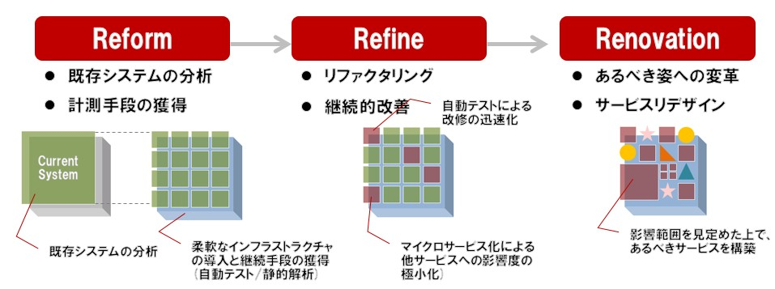

# COBOL Abolishment Reference guide

## 01. Introduction

### I. Purpose of the guide
This guide was created to serve as a reference on the approach used to convert a Cobol based system to Java.

It is based on conversion trials performed on the PCS/CATS2 system.

### II. Target readers for the guideline

- People interested in converting Cobol based applications to Java
- Owners of Cobol based applications
- Cobol applications developers/vendors

## 02. Overall Approach (“Reform → Refine → Renovation” in PCS/CATS)
The approach taken to convert Cobol based systems to microservices created in the Java language, consisted on having 3 transformation phases : Reform, Refine and Renovation.

**Reform :**
Services and system structures are not changed, in order to enable changeability of the hardware and software architecture.

**Refine :**
Improve non-functional requirements and maintainability, by changing hardware/software architecture and system structure, but keeping the existing functions.

**Renovation :**
Change existing functions or add new ones, improving usability of the system and user experience.