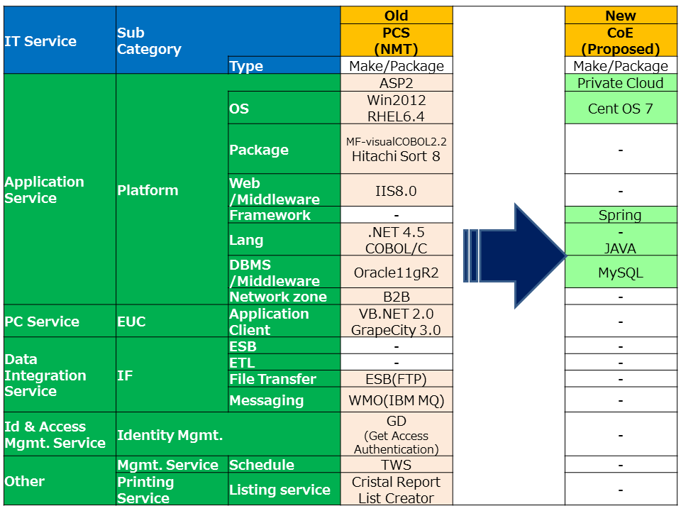
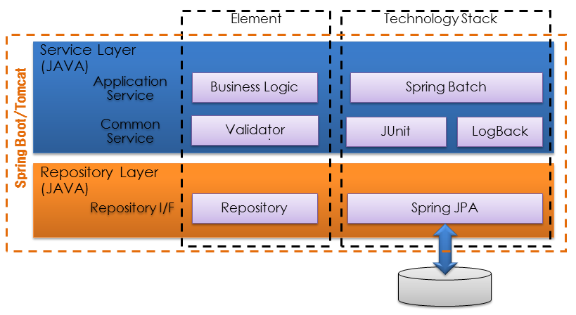
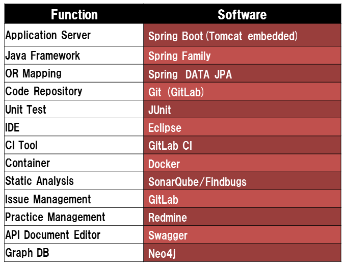

# PCS/CATS2 Reform Reference Guideline

## 01. Overview
    
### I. Purpose of the guideline
 
To compile results from PCS/CATS2 Reform Trial and create a reference guide to be applied in other Cobol based applications.
    
### II. Target readers for the guideline

- People interested in converting Cobol based applications to Java
- Owners of IB2 + IB6 Cobol based applications
- Cobol applications developers/vendors

### III. Practice

- This document bases on practices implemented during the execution of Reform Trial in PCS/CATS2.
- Reform trial execution period : June - October 2016 
- Target functions
    - PCS/CATS2 [Batch] N62 - Vehicle production report
    - PCS/CATS2 [Batch] E2A - Applied check 
    
## 02. Overall Approach (“Reform → Refine → Renovation” in PCS/CATS)
The approach taken to convert Cobol based systems to microservices created in the Java language, consisted on having 3 transformation phases : Reform, Refine and Renovation.

**Reform :**
Services and system structures are not changed, in order to enable changeability of the hardware and software architecture.

**Refine :**
Improve non-functional requirements and maintainability, by changing hardware/software architecture and system structure, but keeping the existing functions.

**Renovation :**
Change existing functions or add new ones, improving usability of the system and user experience.

## 03. ’Reform’ in PCS/CATS2
### I. Requirement in PCS/CATS2 Reform
- Technology
    - System must be developed with Java language and must not have any COBOL programs
    - System must apply architecture specified by Nissan, as referred to hereinafter
- Architecture
    - Services must be loosely coupled with REST interface
    - Services must be ready for Refactoring
- CI/CD
    - System must be in DevOps Environment
- Functionality
    - System must have current functionalities
    
*Refer Section 1, 2, 3 and 5 of ["CoE Guideline"](https://jp.nissan.biz/bitbucket/projects/APX0009/repos/coe-guideline/browse/en/guideline_system-renovation-e.md#init) in detail

### II. Approach in PCS/CATS2 Reform
- Do “compare test” with production data to ensure current functionalities
    - “compare test” is done as CT for ease to prepare test data from production data. (UT is skipped.)
    - UT test codes are prepared after CT completed for further “Refactoring”.
    - Service granularity is not changed to do “compare test”.
    - Database design is not changed to do “compare test”.

### III. Architecture in PCS/CATS2 Reform

#### Architecture changes in PCS/CATS2 Reform

#### Architecture of Reform Trial

#### New Software Stack

## 04. Reform flow diagram
In the following chapter, the Reform process is detailed step-by-step 
- ["A. Reform Flow Diagram](02_ProcessReference-A_Reform.md)
   - ["A.1. Investigate / Plan Flow Diagram"](02_ProcessReference_A.1.md)
   - ["A.2-1. Create Documents Flow Diagram"](02_ProcessReference_A.2-1.md)
   - ["A.2-2. Implement Test Code"](02_ProcessReference_A.2-2.md)
   - ["A.2-3. Prepare Test Data Flow Diagram"](02_ProcessReference_A.2-3.md)
   - ["A.3. Develop"](02_ProcessReference_A.3.md)

## 05. UT/CT Results static analysis
- ["Static analysis report"](files/ResultsOf_UT-CT_StaticAnalysis.pdf)

## 06. Next phases : ’Refine’ and 'Renovation' in PCS/CATS2
### Refine
　基本方針
サービスの外部仕様に変更がないレベルでの改修を前提とする。
具体的には“テストデータ”に変更が発生しない変更を対象とする。
リファクタリングと自動テストを継続的に繰り返し、継続的向上を実現する。
自動テストにて、システムの正当性を担保しながら、KPIをモニタリングしリファクタリング結果を確認、有効性向上を実現する。
本フェーズで検討するRefine対象アイテムは以下の通り。
Data項目の英語名称化
コーディング基準違反対応(CheckStyle結果対応)
潜在バグ対応（SonarQube/FindBugｓ結果対応）
Performance Tuning
汎用テーブルの実テーブル化

上記のItemにおいて優先順位を設定し、工数範囲内での対応を実施する。

### Renovation
基本方針
サービスの外部仕様に変更が発生する改修
具体的には“テストデータ”に変更が発生する変更を対象とする。
改修に伴い、”テストデータ”の変更を加えながら正当性の検証をおこなう。
テストデータの正当性は基本的にユーザーに実施していただく必要がある。
　 *但し、テストデータに変化は発生するが、ビジネスへの影響がない場合はその限りではない。
自動テストにて、システムの正当性を担保しながら、KPIをモニタリングを継続する

## Refine flow diagram
In the following chapter, the Refine process is detailed step-by-step 
- [B.1. Requirement & Backlog](02_ProcessReference_B.1.md)
- [B.3. Refactoring](02_ProcessReference_B.3.md)
- B.4. Deliver (Out of scope)

## Renovation flow diagram
In the following chapter, the Renovation process is detailed step-by-step 
- C.1. Requirement & Backlog (Out of scope)
- C.2. Design (Out of scope)
- C.3. Develop (Out of scope)
- C.4. Deliver (Out of scope)
     
--------------------

## Appendix
 ["CoE Guideline"](https://jp.nissan.biz/bitbucket/projects/APX0009/repos/coe-guideline/browse/en/guideline_system-renovation-e.md#init)