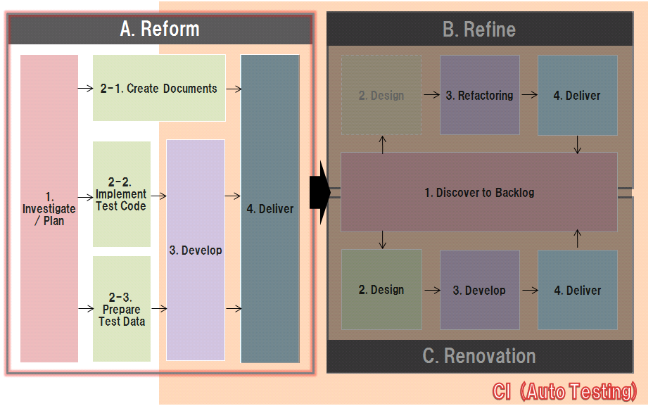

# PCS/CATS COBOL Abolition Reform Trial Reference - Top

## Development Flow Diagram

## Table of contents

1. [A.1. Investigate & Plan](02_ProcessReference_A.1.md)
1. [A.2-1. Create Documents](02_ProcessReference_A.2-1.md)
1. [A.2-2. Implement Test Code](02_ProcessReference_A.2-2.md)
1. [A.2-3. Prepare Test Data](02_ProcessReference_A.2-3.md)
1. [A.3. Develop](02_ProcessReference_A.3.md)
1. A.4. Deliver (Out of scope)

***

### Observation

Although the steps of *"Implement Test Code (A.2-2)"* and *"Prepare Test Data (A.2-3)"* are described in this guide, 
you might notice that there is no *"Execute the Test"* step.

This is because it is assumed that the test is automatically executed, since a CI (continuous integration) tool is being used.