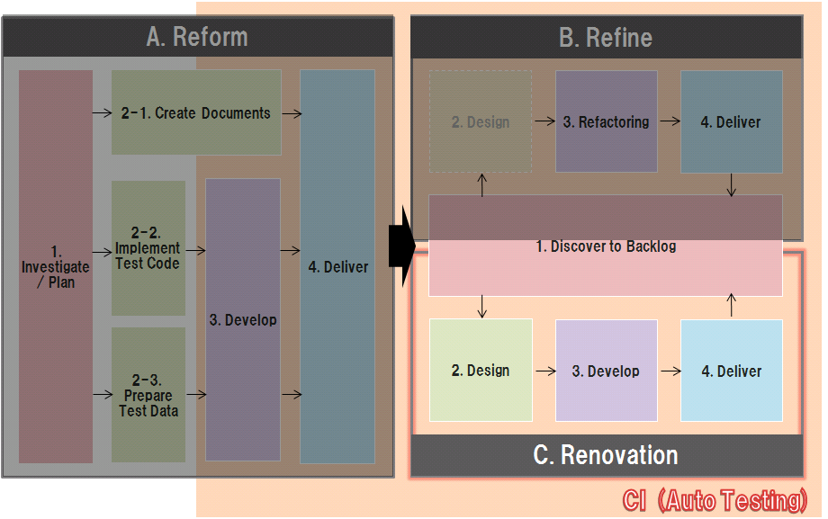

# PCS/CATS COBOL Abolition Renovation Trial Reference - Top

## Development Flow Diagram

## Table of contents

1. C.1. Requirement & Backlog (Out of scope)
1. C.2. Design (Out of scope)
1. C.3. Develop (Out of scope)
1. C.4. Deliver (Out of scope)