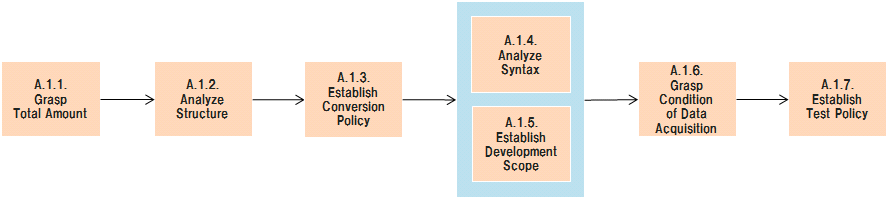

# PCS/CATS Reform Reference - A.1. Investigate / Plan

## A.1. Investigate / Plan Flow Diagram

## Table of contents

1. [A.1.1. Grasp Total Amount](#a11-grasp-total-amount)
1. [A.1.2. Analyze Structure](#a12-analyze-structure)
1. [A.1.3. Establish Conversion Policy](#a13-establish-conversion-policy)
1. [A.1.4. Analyze Syntax](#a14-analyze-syntax)
1. [A.1.5. Establish Development Scope](#a15-establish-development-scope)
1. [A.1.6. Grasp Condition of Data Acquisition](#a16-grasp-condition-of-data-acquisition)
1. [A.1.7. Establish Test Policy](#a17-establish-test-policy)

## A.1.1. Grasp Total Amount

| #  | Element                      | Content |
|----|------------------------------|---|
| 1  | **Summary**                  | 現行システムの全リソースを調査し、リソース本数や総行数等を割り出す。  類似の解析結果はChangeMinerでも得られるが、ChangeMinerには不足や観点の違いがあることが分かっている。そのため、不足や観点の違いを補うための解析が必要となる。 |
| 2  | **Objective & Concept**      | 現行システムの全体規模感を把握する。 |
| 3  | **Output creation rule**     | N/A |
| 4  | **Input**                    | - 現行システムの全リソース |
| 5  | **Output**                   | - 全量把握結果 |
| 6  | **Sample & Template & Tool** | [(sample)Redorm_Target-Program-list.xlsx](reform_sample/Redorm_Target-Program-list.xlsx) |
| 7  | **Basic unit**               | 3[Days] *(Not depend on the system scale)* |
| 8  | **Findings & Issues**        | [Findings & Issues List](https://jp.nissan.biz/redmine/projects/coe_guideline/issues?query_id=558) |

## A.1.2. Analyze Structure

| #  | Element                      | Content |
|----|------------------------------|---|
| 1  | **Summary**                  | 現行システム全リソースの構造を解析し、機能やプログラム言語、Common/Local、等の分類を行う。   類似の解析結果はChangeMinerでも得られるが、ChangeMinerには不足や観点の違いがあることが分かっている。そのため、不足や観点の違いを補うための解析が必要となる。 |
| 2  | **Objective & Concept**      | 分類単位の内容や規模感を把握する。 |
| 3  | **Output creation rule**     | N/A |
| 4  | **Input**                    | - 現行システムの全リソース   - 全量把握結果 |
| 5  | **Output**                   | - 構造分析結果 |
| 6  | **Sample & Template & Tool** | N/A |
| 7  | **Basic unit**               | 3[Days] *(Not depend on the system scale)* |
| 8  | **Findings & Issues**        | [Findings & Issues List](https://jp.nissan.biz/redmine/projects/coe_guideline/issues?query_id=559) |

## A.1.3. Establish Conversion Policy

| #  | Element                      | Content |
|----|------------------------------|---|
| 1  | **Summary**                  | 現行システムの分類結果を元に、既存モジュールの再利用性などを考慮し、分類毎のConversionの方針や範囲を決定する。  - SHELL(MAIN/SUB/SORT)/COBOL/COBOL+C/COPY/CはJAVA化する。   - PARAMは再利用する。 |
| 2  | **Objective & Concept**      | 分類毎のConversionの方針や範囲を決定する。 |
| 3  | **Output creation rule**     | N/A |
| 4  | **Input**                    | - 構造解析結果 |
| 5  | **Output**                   | - Conversion方針   - ConversionScope |
| 6  | **Sample & Template & Tool** | N/A |
| 7  | **Basic unit**               | 1[Day] *(Not depend on the system scale)* |
| 8  | **Findings & Issues**        | [Findings & Issues List](https://jp.nissan.biz/redmine/projects/coe_guideline/issues?query_id=560) |

## A.1.4. Analyze Syntax

| #  | Element                      | Content |
|----|------------------------------|---|
| 1  | **Summary**                  | 機能やプログラム言語単位にリソースの構文を解析し、プログラム間の関係性やデータ入出力の明確化などを行う。 |
| 2  | **Objective & Concept**      | プログラム間の関係性やデータの入出力を明確にする。 |
| 3  | **Output creation rule**     | - Conversion方針 |
| 4  | **Input**                    | - 現行システムの全リソース   - 構造解析結果   - Conversionスコープ |
| 5  | **Output**                   | - D0420_Step_task_list   - D0490_CRUD_matrix |
| 6  | **Sample & Template & Tool** | - [(sample)D0420_Step_task_list](reform_sample/D0420_StepTaskList.xlsx)   - [(sample)D0490_CRUD_matrix](reform_sample/D0490_CRUD_matrix.xlsx) |
| 7  | **Basic unit**               | 2[Days] / 1[MainShell] |
| 8  | **Findings & Issues**        | [Findings & Issues List](https://jp.nissan.biz/redmine/projects/coe_guideline/issues?query_id=561) |

## A.1.5. Establish Development Scope

| #  | Element                      | Content |
|----|------------------------------|---|
| 1  | **Summary**                  | D0420_Step_task_list.xlsxやD0490_CRUD_matrix.xlsx等をInputにし、開発範囲を決めて、対応ボリュームを明確にする。  開発対象をシステム全体とするのか、サービス単位に切り出すのかを検討する。範囲決定後、対象の対応ボリュームを明確にする。 |
| 2  | **Objective & Concept**      | 開発範囲と対応ボリュームを明確にする。 |
| 3  | **Output creation rule**     | N/A |
| 4  | **Input**                    | - D0420_Step_task_list.xlsx   - D0490_CRUD_matrix.xlsx   - 要件(ヒアリング) |
| 5  | **Output**                   | - 開発スコープ |
| 6  | **Sample & Template & Tool** | - [(sample)D0420_Step_task_list](reform_sample/D0420_StepTaskList.xlsx)   - [(sample)D0490_CRUD_matrix](reform_sample/D0490_CRUD_matrix.xlsx) |
| 7  | **Basic unit**               | 1[Day] *(Not depend on the system scale)* |
| 8  | **Findings & Issues**        | [Findings & Issues List](https://jp.nissan.biz/redmine/projects/coe_guideline/issues?query_id=562) |

## A.1.6. Grasp Condition of Data Acquisition

| #  | Element                      | Content |
|----|------------------------------|---|
| 1  | **Summary**                  | 現行システムから得られるBackup fileやDB dataを調査し、保持粒度や保持タイミング、保持期間などを明確にする。  現行システムからのBackup data取得などのためにAMOの協力を必要とする。 |
| 2  | **Objective & Concept**      | Testに利用可能なDataの状態を把握する。 |
| 3  | **Output creation rule**     | N/A |
| 4  | **Input**                    | - 現行システムの全リソース   - 現行システムの全バックアップデータ |
| 5  | **Output**                   | - データ状況把握結果 |
| 6  | **Sample & Template & Tool** | N/A |
| 7  | **Basic unit**               | 10[m] / 1[MainShell] + AMO cost |
| 8  | **Findings & Issues**        | [Findings & Issues List](https://jp.nissan.biz/redmine/projects/coe_guideline/issues?query_id=563) |

## A.1.7. Establish Test Policy

| #  | Element                      | Content |
|----|------------------------------|---|
| 1  | **Summary**                  | データ状態の把握結果からテスト駆動方式、テストパターン、などを検討し、テスト方針を定める。  - 現行システムから得られるBackup fileやDB dataをTest dataとすることで、本番とのCompare test相当とし、品質を保証する。   - Backupの保持粒度から、CT駆動とするかUT駆動とするかを決定する。CT駆動の場合はCT完了後にUT dataを生成することとする。   - また、保持タイミングと保持期間からテストパターンを決定する。基本はDailyであれば1ヶ月分、Weeklyであれば3ヶ月分、Mohthlyであれば1年分としたいが、DB dataのBackupは最大1ヶ月分しか保持されておらず、パラメータテーブルにおいてはBackupが取得されていないため、ある一定期間AMOに取得の依頼を検討する。 |
| 2  | **Objective & Concept**      | テスト方針（テスト駆動方式、テストパターン、など）を決定する。 |
| 3  | **Output creation rule**     | N/A |
| 4  | **Input**                    | - データ状況把握結果   - 現行システムの全リソース   - 現行システムの全バックアップデータ |
| 5  | **Output**                   | - テスト方針 |
| 6  | **Sample & Template & Tool** | [(sample)PCS-Reform_TestPolicy.pptx](reform_sample/PCS-Reform_TestPolicy.pptx) |
| 7  | **Basic unit**               | 4[h] / 2[man] |
| 8  | **Findings & Issues**        | [Findings & Issues List](https://jp.nissan.biz/redmine/projects/coe_guideline/issues?query_id=472) |