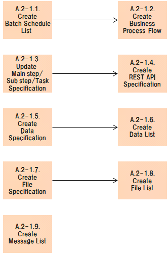

# PCS/CATS Reform Reference - A.2-1. Create Documents

## A.2-1. Create Documents Flow Diagram

## Table of contents

1. [A.2-1.1. Create Batch schedule list](#a2-11-create-batch-scedule-list)
1. [A.2-1.2. Create Business process flow](#a2-12-create-business-process-flow)
1. [A.2-1.3. Create Main step/Sub step/Task Specification](#a2-13-create-main-stepsub-steptask-specification)
1. [A.2-1.4. Create REST API Specification](#a2-14-create-rest-api-specification)
1. [A.2-1.5. Create Data specification](#a2-15-create-data-specification)
1. [A.2-1.6. Create Data list](#a2-16-create-data-list)
1. [A.2-1.7. Create File specification](#a2-17-create-file-specification)
1. [A.2-1.8. Create File list](#a2-18-create-file-list)
1. [A.2-1.9. Create Message list](#a2-19-create-message-list)

## A.2-1.1. Create Batch Schedule List

| #  | Element                      | Content |
|----|------------------------------|---|
| 1  | **Summary**                  | メインステップの実行スケジュールを一覧化したリストを作成する。 |
| 2  | **Objective & Concept**      | バッチ処理がいつ実行されているか把握するため。 |
| 3  | **Output creation rule**     | N/A |
| 4  | **Input**                    | - 構造解析結果 |
| 5  | **Output**                   | - D0400_Batch_schedule_list |
| 6  | **Sample & Template & Tool** | - [(sample)D0400_Batch_schedule_list.xlsx](reform_sample/D0400_Batch_schedule_list.xlsx) |
| 7  | **Basic unit**               | メインシェル100行あたり0.1時間 |
| 8  | **Findings & Issues**        | [Findings & Issues List](https://jp.nissan.biz/redmine/projects/coe_guideline/issues?query_id=473) |

## A.2-1.2. Create Business Process Flow

| #  | Element                      | Content |
|----|------------------------------|---|
| 1  | **Summary**                  | ビジネスプロセスの遷移表及び遷移フローを作成する。  遷移フローはグラフDBで作成する。 |
| 2  | **Objective & Concept**      | バッチ処理の流れを把握するため。 |
| 3  | **Output creation rule**     | N/A |
| 4  | **Input**                    | - D0400_Batch_schedule_list   - 構造解析結果 |
| 5  | **Output**                   | - D0410_Business_process_flow |
| 6  | **Sample & Template & Tool** | - [(sample)D0400_Batch_schedule_list](reform_sample/D0400_Batch_schedule_list.xlsx)   - [(sample)D0410_Business_process_flow](reform_sample/D0410_Business_proc_flow.xlsx) |
| 7  | **Basic unit**               | メインシェル100行あたり0.1時間 |
| 8  | **Findings & Issues**        | [Findings & Issues List](https://jp.nissan.biz/redmine/projects/coe_guideline/issues?query_id=474) |

## A.2-1.3. Create Main Step/Sub Step/Task Specification

| #  | Element                      | Content |
|----|------------------------------|---|
| 1  | **Summary**                  | メインステップ/サブステップ/タスクの仕様を記載した仕様書を作成する。  - I/O, 呼び出すプログラムの情報など一覧化しやすいものはExcelで作成する。    - プログラムの挙動を自然言語で記述した詳細仕様部はmarkdownで作成し、Excelの一覧情報をmarkdown表示にマージする。   - サブステップのI/O及び呼び出し関係のフロー図をグラフDB で描く。 |
| 2  | **Objective & Concept**      | 各プログラムの詳細仕様を明確化するため。 |
| 3  | **Output creation rule**     | N/A |
| 4  | **Input**                    | - D0420_Step_task_list.xlsx   - D0490_CRUD_matrix.xlsx   - メインシェル/サブシェル/ソートシェル/タスクのソースコード|
| 5  | **Output**                   | - D0421_Main_step_specification   - D0422_Sub_step_specification   - D0423_Task_specification |
| 6  | **Sample & Template & Tool** | - [(sample)D0420_Step_task_list](reform_sample/D0420_StepTaskList.xlsx)   - [(sample)D0490_CRUD_matrix](reform_sample/D0490_CRUD_matrix.xlsx)   - [(sample)D0421_Main_step_specification](reform_sample/DN62CARLISTM002.md)   - [(sample)D0422_Sub_step_specification](reform_sample/DN6275LM.md)   - [(sample)D0423_Task_specification](reform_sample/E62X20.md) |
| 7  | **Basic unit**               | - メインステップ：メインシェル100行あたり4時間   - サブステップ：サブシェル400行あたり8時間   - タスク：ソートシェルは10行あたり0.4時間、COBOLは200行あたり8時間    |
| 8  | **Findings & Issues**        | [Findings & Issues List](https://jp.nissan.biz/redmine/projects/coe_guideline/issues?query_id=475) |

## A.2-1.4. Create REST API Specification

| #  | Element                      | Content |
|----|------------------------------|---|
| 1  | **Summary**                  | サービス単位でAPIの仕様を記載した仕様書を作成する。  仕様書をAPIドキュメント作成ツールのデファクトとなりつつあるSwaggerで作成する。 |
| 2  | **Objective & Concept**      | システム連携の方法を明確化するため。 |
| 3  | **Output creation rule**     | N/A |
| 4  | **Input**                    | - D0421_Main_step_specification   - メインシェルのソースコード|
| 5  | **Output**                   | - D0315_REST_API_specification |
| 6  | **Sample & Template & Tool** | - [(sample)D0421_Main_step_specification](reform_sample/DN62CARLISTM002.md)   - [(sample)D0315_REST_API_specification](reform_sample/D0315_REST_API_specification.yaml) |
| 7  | **Basic unit**               | メインシェル100行あたり2時間 |
| 8  | **Findings & Issues**        | [Findings & Issues List](https://jp.nissan.biz/redmine/projects/coe_guideline/issues?query_id=476) |

## A.2-1.5. Create Data Specification

| #  | Element                      | Content |
|----|------------------------------|---|
| 1  | **Summary**                  | DBの各テーブルに格納されるデータの仕様を記載した仕様書を作成する。 |
| 2  | **Objective & Concept**      | 各テーブルの格納データの詳細を把握するため。 |
| 3  | **Output creation rule**     | N/A |
| 4  | **Input**                    | - DDLファイル |
| 5  | **Output**                   | - D0450_Data_specification |
| 6  | **Sample & Template & Tool** | - [(sample)D0450_Data_specification](reform_sample/SHIYOU_182.md) |
| 7  | **Basic unit**               | 1テーブルあたり1時間 |
| 8  | **Findings & Issues**        | [Findings & Issues List](https://jp.nissan.biz/redmine/projects/coe_guideline/issues?query_id=477) |

## A.2-1.6. Create Data List

| #  | Element                      | Content |
|----|------------------------------|---|
| 1  | **Summary**                  | DBの各テーブルに格納されるデータ情報を一覧化する。 |
| 2  | **Objective & Concept**      | DB格納データの概要を把握するため。 |
| 3  | **Output creation rule**     | N/A |
| 4  | **Input**                    | - D0450_Data_specification |
| 5  | **Output**                   | - D0440_Data_list |
| 6  | **Sample & Template & Tool** | - [(sample)D0450_Data_specification](reform_sample/SHIYOU_182.md)   - [(sample)D0440_Data_list](reform_sample/D0440_Data_list.xlsx) |
| 7  | **Basic unit**               | 1テーブルあたり0.1時間 |
| 8  | **Findings & Issues**        | [Findings & Issues List](https://jp.nissan.biz/redmine/projects/coe_guideline/issues?query_id=478) |

## A.2-1.7. Create File Specification

| #  | Element                      | Content |
|----|------------------------------|---|
| 1  | **Summary**                  | 各ファイルの格納データを記載した仕様書を作成する。  - PID付きのファイルはメモリ化するため仕様書作成対象から除外した。   - 中身の構造が重複しているものは仕様書を1つのみ作成した。   - パラメータファイルの仕様はパラメータ定義書で書くため今回のトライアルではスコープ外とした。 |
| 2  | **Objective & Concept**      | 各ファイルの格納データの詳細を把握するため。 |
| 3  | **Output creation rule**     | N/A |
| 4  | **Input**                    | ソースコード |
| 5  | **Output**                   | - D0470_File_specification |
| 6  | **Sample & Template & Tool** | - [(sample)D0470_File_specification](reform_sample/DN62CARMAINM002.6DN6275LM.SHIYOU.md) |
| 7  | **Basic unit**               | 1ファイルあたり1時間 |
| 8  | **Findings & Issues**        | [Findings & Issues List](https://jp.nissan.biz/redmine/projects/coe_guideline/issues?query_id=479) |

## A.2-1.8. Create File List

| #  | Element                      | Content |
|----|------------------------------|---|
| 1  | **Summary**                  | 各ファイルに格納されるデータ情報を一覧化する。 |
| 2  | **Objective & Concept**      | ファイル格納データの概要を把握するため。 |
| 3  | **Output creation rule**     | N/A |
| 4  | **Input**                    | - D0470_File_specification |
| 5  | **Output**                   | - D0460_File_list |
| 6  | **Sample & Template & Tool** | - [(sample)D0470_File_specification](reform_sample/DN62CARMAINM002.6DN6275LM.SHIYOU.md)   - [(sample)D0460_File_list](reform_sample/D0460_File_list.xlsx) |
| 7  | **Basic unit**               | 1ファイルあたり0.1時間 |
| 8  | **Findings & Issues**        | [Findings & Issues List](https://jp.nissan.biz/redmine/projects/coe_guideline/issues?query_id=480) |

## A.2-1.9. Create Message List

| #  | Element                      | Content |
|----|------------------------------|---|
| 1  | **Summary**                  | プログラムから出力されるメッセージを一覧化する。  - 保守メンバの行動につながるメッセージ(重要な確認メッセージ、エラーメッセージなど)のみ一覧化する。 |
| 2  | **Objective & Concept**      | 保守メンバがメッセージの意味を把握出来るようにするため。 |
| 3  | **Output creation rule**     | N/A |
| 4  | **Input**                    | - メインシェル、サブシェル、タスクのソースコード   - DB、ファイル |
| 5  | **Output**                   | - D0480_Message_list |
| 6  | **Sample & Template & Tool** | - [(sample)D0480_Message_list](reform_sample/D0480_Message_list.xlsx) |
| 7  | **Basic unit**               | (当初想定)メインステップ・サブステップのメッセージ   - メインシェル100行あたり0.2時間   サブシェル400行あたり1時間   (N62/E2Aトライアル)タスクのメッセージ   - 1メッセージあたり1時間  |
| 8  | **Findings & Issues**        | [Findings & Issues List](https://jp.nissan.biz/redmine/projects/coe_guideline/issues?query_id=481) |