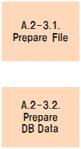

# PCS/CATS Reform Reference - A.2-3. Prepare Test Data

## A.2-3. Prepare Test Data Flow Diagram

## Table of contents

1. [A.2-3.1. Prepara File](#a2-31-prepara-file)
1. [A.2-3.2. Prepara DB Data](#a2-32-prepara-db-data)

## A.2-3.1. Prepara File

| #  | Element                      | Content |
|----|------------------------------|---|
| 1  | **Summary**                  | 現行システムから得られるPrameter fileやSAM file (Backup file)をCT用のTest dataとして任意の格納先に配置する。  現行システムから得られるFileは一切加工せず、そのまま利用することとする。    * 加工してしまうと、Test dataを衝とした品質保障が困難になってしまうため |
| 2  | **Objective & Concept**      | CT用Test data (File)の準備 |
| 3  | **Output creation rule**     | - テスト方針 |
| 4  | **Input**                    | - Parameter file   - SAM file (Backup file) |
| 5  | **Output**                   | - Test Data for CT |
| 6  | **Sample & Template & Tool** | N/A |
| 7  | **Basic unit**               | - 10[m] / 1[SubShell] * 1[Pattern]   - 1[m] / 1[MainShell] * 1[Pattern] |
| 8  | **Findings & Issues**        | [Findings & Issues List](https://jp.nissan.biz/redmine/projects/coe_guideline/issues?query_id=518) |

## A.2-3.2. Prepara DB Data

| #  | Element                      | Content |
|----|------------------------------|---|
| 1  | **Summary**                  | 現行システムから得られるDB dataを加工し、CT用のTest dataとして任意の格納先に配置する。  現行システムから得られるDB data (Dmp file)をJson形式に加工して利用することとする。    * Oracleに依存させないため |
| 2  | **Objective & Concept**      | CT用Test data (DB data)の準備 |
| 3  | **Output creation rule**     | - テスト方針 |
| 4  | **Input**                    | - DB data |
| 5  | **Output**                   | - Test Data for CT |
| 6  | **Sample & Template & Tool** | - [(sample)SHIYOU_182](reform_sample/SHIYOU_182.json) |
| 7  | **Basic unit**               | - 20[m] / 1[Table] * 1[Pattern] |
| 8  | **Findings & Issues**        | [Findings & Issues List](https://jp.nissan.biz/redmine/projects/coe_guideline/issues?query_id=519) |