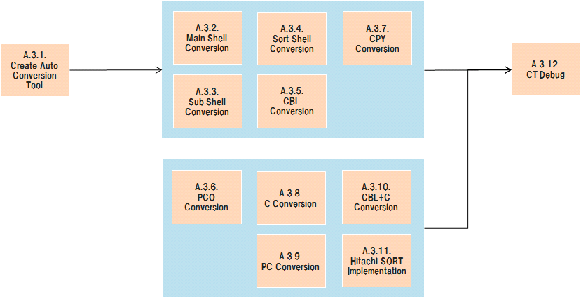

# PCS/CATS Reform Reference - A.3. Develop

## A.3. Develop

## Table of contents

1. [A.3.1. Create Auto Conversion Tool](#a31-create-auto-conversion-tool)
1. [A.3.2. Main Step Conversion](#a32-main-step-conversion)
1. [A.3.3. Sub Step Conversion](#a33-sub-step-conversion) 
1. [A.3.4. Sort Shell Conversion](#a34-sort-shell-conversion)
1. [A.3.5. CBL Conversion](#a35-cbl-conversion)
1. [A.3.6. PCO Conversion](#a36-pco-conversion)
1. [A.3.7. CPY Conversion](#a37-cpy-conversion)
1. [A.3.8. C Conversion](#a38-c-conversion)
1. [A.3.9. PC Conversion](#a39-pc-conversion)
1. [A.3.10. CBL+C Conversion](#a310-cblc-conversion)
1. [A.3.11. Hitachi SORT Implementation](#a311-hitachi-sort-implementation)
1. [A.3.12. CT Debug](#a312-ct-debug)

## A.3.1. Create Auto Conversion Tool

| #  | Element                      | Content |
|----|------------------------------|---|
| 1  | **Summary**                  | JAVAへの自動コンバージョンツールを作成する。 |
| 2  | **Objective & Concept**      | コンバージョン作業を効率化するため。 |
| 3  | **Output creation rule**     | N/A |
| 4  | **Input**                    | - メインシェル/サブシェル/ソートシェル/タスクのソースコード |
| 5  | **Output**                   | - PCS_Parser(for Trial)   - PCS_Generator(for Trial) |
| 6  | **Sample & Template & Tool** | N/A |
| 7  | **Basic unit**               | N/A |
| 8  | **Findings & Issues**        | [Findings & Issues List](https://jp.nissan.biz/redmine/projects/coe_guideline/issues?query_id=520) |

## A.3.2. Main Step Conversion

| #  | Element                      | Content |
|----|------------------------------|---|
| 1  | **Summary**                  | メインシェルをJAVAにコンバートする。  適用できるものに対しては自動コンバージョンツール(Parser,Generator)を適用する。 |
| 2  | **Objective & Concept**      | COBOL等を廃止し、JAVAにコンバートする。 |
| 3  | **Output creation rule**     | N/A |
| 4  | **Input**                    | - メインシェルのソースコード |
| 5  | **Output**                   | - JAVA形式のメインステップソースコード |
| 6  | **Sample & Template & Tool** | - (tool)PCS_Parser(for Trial)   - (tool)PCS_Generator(for Trial)   - [(sample)DN62CARMAINM002.sh(input)](reform_sample/DN62CARMAINM002.sh)   - [(sample)Dn62carmainm002.java(output)](reform_sample/Dn62carmainm002.java)|
| 7  | **Basic unit**               | 手動コンバージョン：100ステップあたり2時間 |
| 8  | **Findings & Issues**        | [Findings & Issues List](https://jp.nissan.biz/redmine/projects/coe_guideline/issues?query_id=521) |

## A.3.3. Sub Step Conversion

| #  | Element                      | Content |
|----|------------------------------|---|
| 1  | **Summary**                  | サブシェルをJAVAにコンバートする。  適用できるものに対しては自動コンバージョンツール(Parser,Generator)を適用する。 |
| 2  | **Objective & Concept**      | COBOL等を廃止し、JAVAにコンバートする。 |
| 3  | **Output creation rule**     | N/A |
| 4  | **Input**                    | - サブシェルのソースコード |
| 5  | **Output**                   | - JAVA形式のサブステップソースコード |
| 6  | **Sample & Template & Tool** | - (tool)PCS_Parser(for Trial)   - (tool)PCS_Generator(for Trial)   - [(sample)DN6275LM.sh(input)](reform_sample/DN6275LM.sh)   - [(sample)Dn6275lm.java(output)](reform_sample/Dn6275lm.java)|
| 7  | **Basic unit**               | 手動コンバージョン：400ステップあたり8時間 |
| 8  | **Findings & Issues**        | [Findings & Issues List](https://jp.nissan.biz/redmine/projects/coe_guideline/issues?query_id=522) |

## A.3.4. Sort Shell Conversion

| #  | Element                      | Content |
|----|------------------------------|---|
| 1  | **Summary**                  | ソートシェルをJAVAにコンバートする。  適用できるものに対しては自動コンバージョンツール(Parser,Generator)を適用する。 |
| 2  | **Objective & Concept**      | COBOL等を廃止し、JAVAにコンバートする。 |
| 3  | **Output creation rule**     | N/A |
| 4  | **Input**                    | - ソートシェルのソースコード |
| 5  | **Output**                   | - JAVA形式のソートソースコード |
| 6  | **Sample & Template & Tool** | - (tool)PCS_Parser(for Trial)   - (tool)PCS_Generator(for Trial)   - [(sample)A562061S.sh(input)](reform_sample/A562061S.sh)   - [(sample)A562061s.java(output)](reform_sample/A562061s.java)|
| 7  | **Basic unit**               | 手動コンバージョン：10ステップあたり0.5時間 |
| 8  | **Findings & Issues**        | [Findings & Issues List](https://jp.nissan.biz/redmine/projects/coe_guideline/issues?query_id=523) |

## A.3.5. CBL Conversion

| #  | Element                      | Content |
|----|------------------------------|---|
| 1  | **Summary**                  | CBLをJAVAにコンバートする。  適用できるものに対しては自動コンバージョンツール(Parser,Generator)を適用する。 |
| 2  | **Objective & Concept**      | COBOL等を廃止し、JAVAにコンバートする。 |
| 3  | **Output creation rule**     | N/A |
| 4  | **Input**                    | - CBLのソースコード |
| 5  | **Output**                   | - JAVA形式のCBLソースコード |
| 6  | **Sample & Template & Tool** | - (tool)PCS_Parser(for Trial)   - (tool)PCS_Generator(for Trial)   - [(sample)E62X20.cbl(input)](reform_sample/E62X20.cbl)   - [(sample)E62x20.java(output)](reform_sample/E62x20.java)|
| 7  | **Basic unit**               | 手動コンバージョン：200ステップあたり16時間 |
| 8  | **Findings & Issues**        | [Findings & Issues List](https://jp.nissan.biz/redmine/projects/coe_guideline/issues?query_id=524) |

## A.3.6. PCO Conversion

| #  | Element                      | Content |
|----|------------------------------|---|
| 1  | **Summary**                  | PCOをJAVAにコンバートする。  全て手動でコンバートする |
| 2  | **Objective & Concept**      | COBOL等を廃止し、JAVAにコンバートする。 |
| 3  | **Output creation rule**     | N/A |
| 4  | **Input**                    | - PCOのソースコード |
| 5  | **Output**                   | - JAVA形式のPCOソースコード |
| 6  | **Sample & Template & Tool** | - [(sample)E62750.pco(input)](reform_sample/E62750.pco)   - [(sample)E62750.java(output)](reform_sample/E62750.java)|
| 7  | **Basic unit**               | 手動コンバージョン：200ステップあたり16時間 |
| 8  | **Findings & Issues**        | [Findings & Issues List](https://jp.nissan.biz/redmine/projects/coe_guideline/issues?query_id=525) |

## A.3.7. CPY Conversion

| #  | Element                      | Content |
|----|------------------------------|---|
| 1  | **Summary**                  | CPYをJAVAにコンバートする。  適用できるものに対しては自動コンバージョンツール(Parser,Generator)を適用する。 |
| 2  | **Objective & Concept**      | COBOL等を廃止し、JAVAにコンバートする。 |
| 3  | **Output creation rule**     | N/A |
| 4  | **Input**                    | - CPYのソースコード |
| 5  | **Output**                   | - JAVA形式のCPYソースコード |
| 6  | **Sample & Template & Tool** | - (tool)PCS_Parser(for Trial)   - (tool)PCS_Generator(for Trial)   - [(sample)ADAFL182.cpy(input)](reform_sample/ADAFL182.cpy)   - [(sample)Adafl182.java(output)](reform_sample/Adafl182.java)|
| 7  | **Basic unit**               | 手動コンバージョン：200ステップあたり16時間 |
| 8  | **Findings & Issues**        | [Findings & Issues List](https://jp.nissan.biz/redmine/projects/coe_guideline/issues?query_id=526) |

## A.3.8. C Conversion

| #  | Element                      | Content |
|----|------------------------------|---|
| 1  | **Summary**                  | CをJAVAにコンバートする。  全て手動でコンバートする |
| 2  | **Objective & Concept**      | COBOL等を廃止し、JAVAにコンバートする。 |
| 3  | **Output creation rule**     | N/A |
| 4  | **Input**                    | - Cのソースコード |
| 5  | **Output**                   | - JAVA形式のCソースコード |
| 6  | **Sample & Template & Tool** | N/A |
| 7  | **Basic unit**               | 手動コンバージョン：200ステップあたり16時間 |
| 8  | **Findings & Issues**        | [Findings & Issues List](https://jp.nissan.biz/redmine/projects/coe_guideline/issues?query_id=527) |

## A.3.9. PC Conversion

| #  | Element                      | Content |
|----|------------------------------|---|
| 1  | **Summary**                  | PCをJAVAにコンバートする。  全て手動でコンバートする |
| 2  | **Objective & Concept**      | COBOL等を廃止し、JAVAにコンバートする。 |
| 3  | **Output creation rule**     | N/A |
| 4  | **Input**                    | - PCのソースコード |
| 5  | **Output**                   | - JAVA形式のPCソースコード |
| 6  | **Sample & Template & Tool** | N/A |
| 7  | **Basic unit**               | 手動コンバージョン：200ステップあたり16時間 |
| 8  | **Findings & Issues**        | [Findings & Issues List](https://jp.nissan.biz/redmine/projects/coe_guideline/issues?query_id=528) |

## A.3.10. CBL+C Conversion

| #  | Element                      | Content |
|----|------------------------------|---|
| 1  | **Summary**                  | C呼び出し処理を含むCBLをJAVAにコンバートする。  全て手動でコンバートする |
| 2  | **Objective & Concept**      | COBOL等を廃止し、JAVAにコンバートする。 |
| 3  | **Output creation rule**     | N/A |
| 4  | **Input**                    | - C呼び出し処理を含むCBLのソースコード |
| 5  | **Output**                   | - JAVA形式のC呼び出し処理を含むCBLソースコード |
| 6  | **Sample & Template & Tool** | N/A |
| 7  | **Basic unit**               | 手動コンバージョン：200ステップあたり16時間 |
| 8  | **Findings & Issues**        | [Findings & Issues List](https://jp.nissan.biz/redmine/projects/coe_guideline/issues?query_id=529) |

## A.3.11. Hitachi SORT Implementation

| #  | Element                      | Content |
|----|------------------------------|---|
| 1  | **Summary**                  | パッケージ製品"Hitachi SORT"相当の機能をJAVAで開発する。  全て手動で開発する |
| 2  | **Objective & Concept**      | COBOL等を廃止し、JAVAにコンバートする。 |
| 3  | **Output creation rule**     | N/A |
| 4  | **Input**                    | - "Hitachi SORT"の仕様 |
| 5  | **Output**                   | - "Hitachi SORT"相当の機能を持つJAVA形式のソースコード |
| 6  | **Sample & Template & Tool** | N/A |
| 7  | **Basic unit**               | 200ステップあたり16時間 |
| 8  | **Findings & Issues**        | [Findings & Issues List](https://jp.nissan.biz/redmine/projects/coe_guideline/issues?query_id=530) |

## A.3.12. CT Debug

| #  | Element                      | Content |
|----|------------------------------|---|
| 1  | **Summary**                  | CTで発見されたバグをデバッグする。  全て手動でデバッグする。 |
| 2  | **Objective & Concept**      | CTに影響するバグを取り除くため。 |
| 3  | **Output creation rule**     | N/A |
| 4  | **Input**                    | - JAVAソースコード |
| 5  | **Output**                   | - JAVAソースコード |
| 6  | **Sample & Template & Tool** | N/A |
| 7  | **Basic unit**               | N/A |
| 8  | **Findings & Issues**        | [Findings & Issues List](https://jp.nissan.biz/redmine/projects/coe_guideline/issues?query_id=531) |