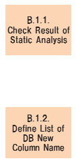

# PCS/CATS Refine Reference - B.1. Requirement & Backlog

## B.1. Requirement & Backlog

## Table of contents

1. [B.1.1 Check Result of Static Analysis](#b11-check-result-of-static-analysis)
1. [B.1.2 Prepare List of New DB Column Name](#b12-prepare-list-of-new-db-column-name)

## B.1.1 Check Result of Static Analysis

| #  | Element                      | Content |
|----|------------------------------|---|
| 1  | **Summary**                  | ソースコードを静的解析ツール掛けた結果リストアップされたIssueを確認し、IssueのRule単位で対応方針を決定する。 |
| 2  | **Objective & Concept**      | それぞれのIssueに対する対応方針を決定するため。 |
| 3  | **Output creation rule**     | - N/A  |
| 4  | **Input**                    | - 静的解析(SonarQube, FindBugs, CheckStyle)結果 |
| 5  | **Output**                   | - 対応すべきIssueリスト  |
| 6  | **Sample & Template & Tool** | [(Output sample)StaticAnalysis_IssueList.xlsx](refine_sample/StaticAnalysis_IssueList.xlsx) |
| 7  | **Basic unit**               | N/A |
| 8  | **Findings & Issues**        | [Findings & Issues List](https://jp.nissan.biz/redmine/projects/coe_guideline/issues?query_id=532) |

## B.1.2 Prepare List of New DB Column Name

| #  | Element                      | Content |
|----|------------------------------|---|
| 1  | **Summary**                  | DBのカラム名の新旧名称の対応表を準備する。 |
| 2  | **Objective & Concept**      | DBカラム名の変更を可能とするため。 |
| 3  | **Output creation rule**     | N/A |
| 4  | **Input**                    | N/A |
| 5  | **Output**                   | - 新旧名称対応表 |
| 6  | **Sample & Template & Tool** | [(Output sample)D0450_DataSpec_STATUS_181_NewColumnNameList.xlsx](refine_sample/D0450_DataSpec_STATUS_181_NewColumnNameList.xlsx) |
| 7  | **Basic unit**               | N/A |
| 8  | **Findings & Issues**        | [Findings & Issues List](https://jp.nissan.biz/redmine/projects/coe_guideline/issues?query_id=533) |