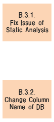

# PCS/CATS Refine Reference - B.3. Refactoring

## B.3. Refactoring

## Table of contents

1. [B.3.1. Fix Issue of Static Analysis](#b31-fix-issue-of-static-analysis)
1. [B.3.2. Change Column Name of DB](#b32-change-column-name-of-db)

## B.3.1. Fix Issue of Static Analysis

| #  | Element                      | Content |
|----|------------------------------|---|
| 1  | **Summary**                  | 静的解析ツールでリストアップされたIssueに対応するようソースコードを修正する。 |
| 2  | **Objective & Concept**      | ソースコードの信頼性・保守性等を高めるため。 |
| 3  | **Output creation rule**     | N/A |
| 4  | **Input**                    | - 対応すべきIssueリスト   - Issue対応前Javaソースコード |
| 5  | **Output**                   | - Issue対応後Javaソースコード  |
| 6  | **Sample & Template & Tool** | [(Input sample)StaticAnalysis_IssueList.xlsx](refine_sample/StaticAnalysis_IssueList.xlsx) |
| 7  | **Basic unit**               | N/A |
| 8  | **Findings & Issues**        | [Findings & Issues List](https://jp.nissan.biz/redmine/projects/coe_guideline/issues?query_id=534) |

## B.3.2. Change Column Name of DB

| #  | Element                      | Content |
|----|------------------------------|---|
| 1  | **Summary**                  | DBのカラム名の新名称に合わせソースコード、DBテストデータを修正する。 |
| 2  | **Objective & Concept**      | DBカラム名を新名称に変換するため。 |
| 3  | **Output creation rule**     | N/A |
| 4  | **Input**                    | - 新旧名称対応表   - 修正前Javaソースコード   - 修正前DBテストデータ(JSON) |
| 5  | **Output**                   | - 修正後Javaソースコード   - 修正後DBテストデータ(JSON) |
| 6  | **Sample & Template & Tool** | - [(Input sample)D0450_DataSpec_STATUS_181_NewColumnNameList.xlsx](refine_sample/D0450_DataSpec_STATUS_181_NewColumnNameList.xlsx)   - [(Input sample)Shiyou182_beforeColumnChange.java](refine_sample/Shiyou182_beforeColumnChange.java)   - [(Input sample)E62750.java](reform_sample/E62750.java)   - [(Input sample)SHIYOU_182_beforeColumnChange.json](refine_sample/SHIYOU_182_beforeColumnChange.json)   - [(Output sample)Shiyou182_afterColumnChange.java](refine_sample/Shiyou182_afterColumnChange.java)   - [(Output sample)E62750.java](refine_sample/E62750.java)   - [(Output sample)SHIYOU_182_afterColumnChange.json](refine_sample/SHIYOU_182_afterColumnChange.json) |
| 7  | **Basic unit**               | N/A |
| 8  | **Findings & Issues**        | [Findings & Issues List](https://jp.nissan.biz/redmine/projects/coe_guideline/issues?query_id=535) |