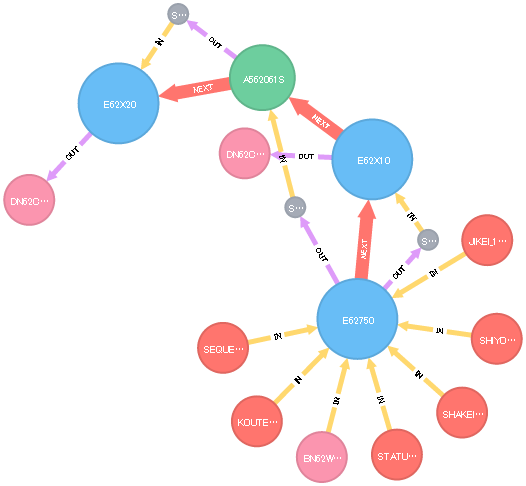

# Sub Step Specification  

## 1. Basic Information  

|**SysNm**|**SubSysCd**|**SubSysNm**|**SubStepID**|**SubStepName**|
|:---:|:---:|:---:|:---:|:---:|
|`PCS`|`N62`||`DN6275LM`||

## 2. Overview  

## 3. Input / Output Information  

1. Input entity  

|**No**|**LogicalName**|**Key**|**PhysicalName**|**Type**|**Kind**|**StepNo**|**TaskID**|**Remarks**|
|---:|:---|:---|:---|:---:|:---:|:---:|:---:|:---|
|1||`-`|`STATUS_181`|`DB`|`Parameter`|`S010`|`E62750`||
|2||`-`|`SHIYOU_182`|`DB`|`Parameter`|`S010`|`E62750`||
|3||`-`|`SHAKEI_183`|`DB`|`Parameter`|`S010`|`E62750`||
|4||`-`|`JIKEI_184`|`DB`|`Parameter`|`S010`|`E62750`||
|5||`-`|`KOUTEI_185`|`DB`|`Parameter`|`S010`|`E62750`||
|6||`-`|`SEQUENCE_180`|`DB`|`Parameter`|`S010`|`E62750`||
|7||`DD_SYSIN`|`${PARAM}/BN62W10G`|`File`|`Parameter`|`S010`|`E62750`||
|8||`DD_SYS011`|`${DATA}/${PID}.S010.SYS031`|`Memory`|`Temporary`|`S015`|`E62X10`||
|9||`DD_SORTIN`|`${DATA}/${PID}.S010.SYS032`|`Memory`|`Temporary`|`S056`|`A562061S`||
|10||`DD_SYS011`|`${DATA}/${PID}.S056.SORTOUT`|`Memory`|`Temporary`|`S057`|`E62X20`||

2. Output entity  

|**No**|**LogicalName**|**Key**|**PhysicalName**|**Type**|**Kind**|**StepNo**|**TaskID**|**Remarks**|
|---:|:---|:---|:---|:---:|:---:|:---:|:---:|:---|
|1||`DD_SYS031`|`${DATA}/${PID}.S010.SYS031`|`Memory`|`Temporary`|`S010`|`E62750`||
|2||`DD_SYS032`|`${DATA}/${PID}.S010.SYS032`|`Memory`|`Temporary`|`S010`|`E62750`||
|3||`DD_SYS031`|`${DATA}/${MODULENAME}.${JCLNAME}.STATUS`|`File`|`Temporary`|`S015`|`E62X10`||
|4||`DD_SORTOUT`|`${DATA}/${PID}.S056.SORTOUT`|`Memory`|`Temporary`|`S056`|`A562061S`||
|5||`DD_SYS031`|`${DATA}/${MODULENAME}.${JCLNAME}.SHIYOU`|`File`|`Temporary`|`S057`|`E62X20`||

3. Parameter entity  

|**No**|**LogicalName**|**Key**|**PhysicalName**|**Type**|**Kind**|**StepNo**|**TaskID**|**Remarks**|
|---:|:---|:---|:---|:---:|:---:|:---:|:---:|:---|

## 4. Called Task List  

|**No**|**TaskID**|**TaskName**|**Overviiew**|
|---:|:---|:---|:---|
|1|`E62750`|||
|2|`E62X10`|||
|3|`A562061S`|||
|4|`E62X20`|||

## 5. Sub Step Flow Diagram  

 

## 6. Sub Step Detail Definition  

1. 開始処理  
	1. 変数JCLNAMEに`${CMNPLANTCD}DN6275LM`をセットする。  
	1. サブステップ名、通知、PIDを元に実行開始メッセージを以下の形式でログに出力する。  

		> STRT_MSGLG ${JCLNAME} ${NOTIFY} ${PID}  

	1. 変数DD_SUBDATに`${DATA}/SYSTEM.SUBDAT`をセットする。  
	1. 変数DD_SUBDATEに`${DATA}/SYSTEM.SUBDATE`をセットする。  

1. S010ステップ処理  
	1. エラーフラグCOND_CODEが`0`かどうかチェックする。  
	1. [COND_CODE=`0`の場合]  
		1. 通知、サブステップ名、ステップNo.を元に実行開始メッセージを以下の形式でログに出力する。  

			> STATLOG ${NOTIFY} "${JCLNAME}" "S010"  

		1. Inputとして以下の変数をセットする。  

			> 1. [3-1. Input entity]#1  

		1. Outputとして以下の変数をセットする。  

			> 1. [3-2. Output entity]#1  

			> 1. [3-2. Output entity]#2  

		1. タスク**[E62750](deliverable/D0423_Task_specification/E62750/E62750.md)**を実行する。  
		1. エラーフラグCOND_CODEにタスクの戻り値をセットする。  
		1. 通知、サブステップ名, ステップNo.を元に実行メッセージを以下の形式でログに出力する。  

			> EXEC_PROC ${NOTIFY} "${JCLNAME}" S010  

		1. 通知、サブステップ名, ステップNo.、エラーコード、処理タイプを元に実行終了メッセージを以下の形式でログに出力する。  

			> ENDLOG ${NOTIFY} "${JCLNAME}" "S010" ${COND_CODE} "PROC"  

1. S015ステップ処理  
	1. エラーフラグCOND_CODEが`0`かどうかチェックする。  
	1. [COND_CODE=`0`の場合]  
		1. 通知、サブステップ名、ステップNo.を元に実行開始メッセージを以下の形式でログに出力する。  

			> STATLOG ${NOTIFY} "${JCLNAME}" "S015"  

		1. Inputとして以下の変数をセットする。  

			> 1. [3-1. Input entity]#2  

		1. Outputとして以下の変数をセットする。  

			> 1. [3-2. Output entity]#3  

		1. タスク**[E62X10](deliverable/D0423_Task_specification/E62X10/E62X10.md)**を実行する。  
		1. エラーフラグCOND_CODEにタスクの戻り値をセットする。  
		1. 通知、サブステップ名, ステップNo.を元に実行メッセージを以下の形式でログに出力する。  

			> EXEC_PROC ${NOTIFY} "${JCLNAME}" S015  

		1. 通知、サブステップ名, ステップNo.、エラーコード、処理タイプを元に実行終了メッセージを以下の形式でログに出力する。  

			> ENDLOG ${NOTIFY} "${JCLNAME}" "S015" ${COND_CODE} "PROC"  

1. S056ステップ処理  
	1. エラーフラグCOND_CODEが`0`かどうかチェックする。  
	1. [COND_CODE=`0`の場合]  
		1. 通知、サブステップ名、ステップNo.を元に実行開始メッセージを以下の形式でログに出力する。  

			> STATLOG ${NOTIFY} "${JCLNAME}" "S056"  

		1. Inputとして以下の変数をセットする。  

			> 1. [3-1. Input entity]#3  

		1. Outputとして以下の変数をセットする。  

			> 1. [3-2. Output entity]#4  

		1. ソートタスク**[A562061S](deliverable/D0423_Task_specification/SORT/A562061S/A562061S.md)**を実行する。  
		1. 通知、サブステップ名, ステップNo.、Input、Outputを元にソート条件メッセージを以下の形式でログに出力する。  

			> SORTFILE ${NOTIFY} "${JCLNAME}" S056 ${DD_SORTIN} ${DD_SORTOUT}  

		1. エラーフラグCOND_CODEにソートタスクの戻り値をセットする。  
		1. 通知、サブステップ名, ステップNo.を元に実行メッセージを以下の形式でログに出力する。  

			> EXEC_UTILS ${NOTIFY} "${JCLNAME}" S056  

		1. 通知、サブステップ名, ステップNo.、エラーコード、処理タイプを元に実行終了メッセージを以下の形式でログに出力する。  

			> ENDLOG ${NOTIFY} "${JCLNAME}" "S056" ${COND_CODE} "UTILS"  

1. S057ステップ処理  
	1. エラーフラグCOND_CODEが`0`かどうかチェックする。  
	1. [COND_CODE=`0`の場合]  
		1. 通知、サブステップ名、ステップNo.を元に実行開始メッセージを以下の形式でログに出力する。  

			> STATLOG ${NOTIFY} "${JCLNAME}" "S057"  

		1. Inputとして以下の変数をセットする。  

			> 1. [3-1. Input entity]#4  

		1. Outputとして以下の変数をセットする。  

			> 1. [3-2. Output entity]#5  

		1. タスク**[E62X20](deliverable/D0423_Task_specification/E62X20/E62X20.md)**を実行する。  
		1. エラーフラグCOND_CODEにタスクの戻り値をセットする。  
		1. 通知、サブステップ名, ステップNo.を元に実行メッセージを以下の形式でログに出力する。  

			> EXEC_PROC ${NOTIFY} "${JCLNAME}" S057  

		1. 通知、サブステップ名, ステップNo.、エラーコード、処理タイプを元に実行終了メッセージを以下の形式でログに出力する。  

			> ENDLOG ${NOTIFY} "${JCLNAME}" "S057" ${COND_CODE} "PROC"  

1. 終了処理  
	1. エラーフラグCOND_CODEが`0`かどうかチェックする。  
	1. [COND_CODE=`0`の場合]  
		1. _"${DATA}/${PID}.*"_フォルダが存在するかどうかチェックする。  
		1. [上記フォルダが存在する場合]  
			1. _"${DATA}/${PID}.*"_フォルダを削除する。  
		1. _"${TEMP}/${PID}.*"_フォルダが存在するかどうかチェックする。  
		1. [上記フォルダが存在する場合]  
			1. _"${TEMP}/${PID}.*"_フォルダを削除する。  
		1. _"${TEMP}/*\_${PID}"_フォルダが存在するかどうかチェックする。  
		1. [上記フォルダが存在する場合]  
			1. _"${TEMP}/*\_${PID}"_フォルダを削除する。  
	1. サブステップ名、通知、PIDを元に実行終了メッセージを以下の形式でログに出力する。  

		> END_MSGLG ${JCLNAME} ${NOTIFY} ${PID}  

	1. エラーフラグCOND_CODEを戻り値として出力し、処理を終了する。  
 
